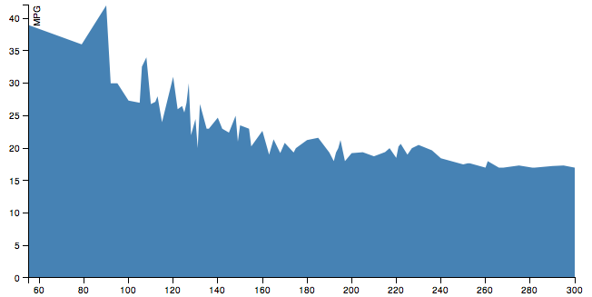

Rynek samochodów osobowych w USA w 2000 roku
==========================
Maciej Stanik
--------------------------
Dane opisują wszystkie modele nowych samochodów osobowych dostępnych na rynku amerykańskim w 2000 roku. 

Do oczyszcznia danych użyłem Google Refine

## Poszczególne kroki

* Wczytanie pliku xlsx.
* Dodanie kolumny z nazwą producenta.
* Usunięcie nazw producentów z wiersza zawierajacego nazwę modelu.
* Rozdzielenie kolumn z warotsciami Horse Power i RPM na 2 osobne.
* Zmiana wszystkich liter na małe.
* Zamiana wartości wiersza Transmission: a -> automatic, m -> manual
* Usunięcie kolumny ABS.
* Usunięcie spacji w nazwach kolumn.
* Eksport do pliku JSON.


## Przykładowe dane
```json
{
  "make" : "bmw",
  "model" : "328ci",
  "price" : 34560,
  "wheel_base" : 107.3,
  "length" : 176.7,
  "width" : 68.5,
  "height" : 54.6,
  "curb_weight" : 3197,
  "horse_power" : 193,
  "rpm" : 5500,
  "transmission" : "manual",
  "mpg_city" : 21,
  "mpg_highway" : 29
}
```

* Oczyszczone dane: [car_market.json](/data/json/car_market.json)

# Agregacje

1\. 10 modeli samochodów o najwyższej mocy silnika

```js
db.cars.aggregate([
	{'$group' : { _id: {make: '$make' , model: '$model'}, horse_power: {'$max' : '$horse_power'}}}, 
	{'$project' : {
		_id : 0 ,
		car : '$_id' ,
		horse_power : 1
		}
	},
	{'$sort' : { horse_power: -1 }},
	{'$limit' : 10}
]);
```

Wynik agregacji:
```json
[
		{
			"horse_power" : 450,
			"car" : {
				"make" : "dodge",
				"model" : "viper r/t"
			}
		},
		{
			"horse_power" : 450,
			"car" : {
				"make" : "dodge",
				"model" : "viper gts"
			}
		},
		{
			"horse_power" : 394,
			"car" : {
				"make" : "bmw",
				"model" : "m5"
			}
		},
		{
			"horse_power" : 390,
			"car" : {
				"make" : "lexus",
				"model" : "ls400"
			}
		},
		{
			"horse_power" : 389,
			"car" : {
				"make" : "mercedes-benz",
				"model" : "sl600"
			}
		},
		{
			"horse_power" : 385,
			"car" : {
				"make" : "ford",
				"model" : "mustang svt cobra r"
			}
		},
		{
			"horse_power" : 370,
			"car" : {
				"make" : "jaguar",
				"model" : "vanden plas s/c"
			}
		},
		{
			"horse_power" : 370,
			"car" : {
				"make" : "jaguar",
				"model" : "xjr"
			}
		},
		{
			"horse_power" : 370,
			"car" : {
				"make" : "jaguar",
				"model" : "xkr"
			}
		},
		{
			"horse_power" : 349,
			"car" : {
				"make" : "mercedes-benz",
				"model" : "e55"
			}
		}
	]
```

2\. Zależność pomiędzy mocą silnika, a średnim spalaniem

```js
db.cars.aggregate([
	{'$group' : { _id: '$horse_power', avg_mpg: {'$avg' : '$mpg_city'}}}, 
	{'$project' : {
		_id : 0 ,
		horse_power : '$_id' ,
		avg_mpg : 1
		}
	},
	{'$sort' : { horse_power: 1 }}
]);
```
Wynik agregacji:
```json
[
		{
			"avg_mpg" : 39,
			"horse_power" : 55
		},
		{
			"avg_mpg" : 61,
			"horse_power" : 73
		},
		{
			"avg_mpg" : 36,
			"horse_power" : 79
		},
		{
			"avg_mpg" : 42,
			"horse_power" : 90
		},
		{
			"avg_mpg" : 30,
			"horse_power" : 92
		},
		{
			"avg_mpg" : 30,
			"horse_power" : 95
		},
		{
			"avg_mpg" : 27.333333333333332,
			"horse_power" : 100
		},
		{
			"avg_mpg" : 27,
			"horse_power" : 105
		},
		{
			"avg_mpg" : 32.57142857142857,
			"horse_power" : 106
		},
		{
			"avg_mpg" : 34,
			"horse_power" : 108
		},
		{
			"avg_mpg" : 26.8,
			"horse_power" : 110
		},
		{
			"avg_mpg" : 27.142857142857142,
			"horse_power" : 112
		},
		{
			"avg_mpg" : 28,
			"horse_power" : 113
		},
		{
			"avg_mpg" : 24,
			"horse_power" : 115
		},
		{
			"avg_mpg" : 31,
			"horse_power" : 120
		},
		{
			"avg_mpg" : 26,
			"horse_power" : 122
		},
		{
			"avg_mpg" : 26.5,
			"horse_power" : 124
		},
		{
			"avg_mpg" : 25.5,
			"horse_power" : 125
		},
		{
			"avg_mpg" : 27,
			"horse_power" : 126
		},
		{
			"avg_mpg" : 30,
			"horse_power" : 127
		},
		{
			"avg_mpg" : 22,
			"horse_power" : 128
		},
		{
			"avg_mpg" : 24.5,
			"horse_power" : 130
		},
		{
			"avg_mpg" : 20,
			"horse_power" : 131
		},
		{
			"avg_mpg" : 26.8,
			"horse_power" : 132
		},
		{
			"avg_mpg" : 23,
			"horse_power" : 135
		},
		{
			"avg_mpg" : 23,
			"horse_power" : 136
		},
		{
			"avg_mpg" : 70,
			"horse_power" : 137
		},
		{
			"avg_mpg" : 24.7,
			"horse_power" : 140
		},
		{
			"avg_mpg" : 23,
			"horse_power" : 142
		},
		{
			"avg_mpg" : 22.4,
			"horse_power" : 145
		},
		{
			"avg_mpg" : 25,
			"horse_power" : 148
		},
		{
			"avg_mpg" : 21,
			"horse_power" : 149
		},
		{
			"avg_mpg" : 23.523809523809526,
			"horse_power" : 150
		},
		{
			"avg_mpg" : 23,
			"horse_power" : 154
		},
		{
			"avg_mpg" : 20.272727272727273,
			"horse_power" : 155
		},
		{
			"avg_mpg" : 22.666666666666668,
			"horse_power" : 160
		},
		{
			"avg_mpg" : 19,
			"horse_power" : 163
		},
		{
			"avg_mpg" : 21.363636363636363,
			"horse_power" : 165
		},
		{
			"avg_mpg" : 19.25,
			"horse_power" : 168
		},
		{
			"avg_mpg" : 20.818181818181817,
			"horse_power" : 170
		},
		{
			"avg_mpg" : 19.333333333333332,
			"horse_power" : 174
		},
		{
			"avg_mpg" : 20,
			"horse_power" : 175
		},
		{
			"avg_mpg" : 21.25,
			"horse_power" : 180
		},
		{
			"avg_mpg" : 21.6,
			"horse_power" : 185
		},
		{
			"avg_mpg" : 19.333333333333332,
			"horse_power" : 190
		},
		{
			"avg_mpg" : 18,
			"horse_power" : 192
		},
		{
			"avg_mpg" : 19.333333333333332,
			"horse_power" : 193
		},
		{
			"avg_mpg" : 20,
			"horse_power" : 194
		},
		{
			"avg_mpg" : 21.25,
			"horse_power" : 195
		},
		{
			"avg_mpg" : 18,
			"horse_power" : 197
		},
		{
			"avg_mpg" : 19.235294117647058,
			"horse_power" : 200
		},
		{
			"avg_mpg" : 19.375,
			"horse_power" : 205
		},
		{
			"avg_mpg" : 18.75,
			"horse_power" : 210
		},
		{
			"avg_mpg" : 19.4,
			"horse_power" : 215
		},
		{
			"avg_mpg" : 20,
			"horse_power" : 217
		},
		{
			"avg_mpg" : 18.5,
			"horse_power" : 220
		},
		{
			"avg_mpg" : 20.25,
			"horse_power" : 221
		},
		{
			"avg_mpg" : 20.666666666666668,
			"horse_power" : 222
		},
		{
			"avg_mpg" : 19,
			"horse_power" : 225
		},
		{
			"avg_mpg" : 20,
			"horse_power" : 227
		},
		{
			"avg_mpg" : 20.5,
			"horse_power" : 230
		},
		{
			"avg_mpg" : 19.666666666666668,
			"horse_power" : 236
		},
		{
			"avg_mpg" : 18.444444444444443,
			"horse_power" : 240
		},
		{
			"avg_mpg" : 17.5,
			"horse_power" : 250
		},
		{
			"avg_mpg" : 17.666666666666668,
			"horse_power" : 252
		},
		{
			"avg_mpg" : 17.666666666666668,
			"horse_power" : 253
		},
		{
			"avg_mpg" : 17,
			"horse_power" : 260
		},
		{
			"avg_mpg" : 18,
			"horse_power" : 261
		},
		{
			"avg_mpg" : 17,
			"horse_power" : 266
		},
		{
			"avg_mpg" : 17,
			"horse_power" : 268
		},
		{
			"avg_mpg" : 17.333333333333332,
			"horse_power" : 275
		},
		{
			"avg_mpg" : 17,
			"horse_power" : 281
		},
		{
			"avg_mpg" : 17,
			"horse_power" : 282
		},
		{
			"avg_mpg" : 17.25,
			"horse_power" : 290
		},
		{
			"avg_mpg" : 17.333333333333332,
			"horse_power" : 295
		},
		{
			"avg_mpg" : 17,
			"horse_power" : 300
		},
		{
			"avg_mpg" : 16.5,
			"horse_power" : 302
		},
		{
			"avg_mpg" : 18,
			"horse_power" : 305
		},
		{
			"avg_mpg" : 17,
			"horse_power" : 320
		},
		{
			"avg_mpg" : 13,
			"horse_power" : 326
		},
		{
			"avg_mpg" : 18,
			"horse_power" : 345
		},
		{
			"avg_mpg" : 16,
			"horse_power" : 349
		},
		{
			"avg_mpg" : 16,
			"horse_power" : 370
		},
		{
			"avg_mpg" : 19,
			"horse_power" : 385
		},
		{
			"avg_mpg" : 13,
			"horse_power" : 389
		},
		{
			"avg_mpg" : 18,
			"horse_power" : 390
		},
		{
			"avg_mpg" : 13,
			"horse_power" : 394
		},
		{
			"avg_mpg" : 12,
			"horse_power" : 450
		}
	],
```



* Skrypt: [link](/scripts/javascript/180_carmarket_agregacje.js).
