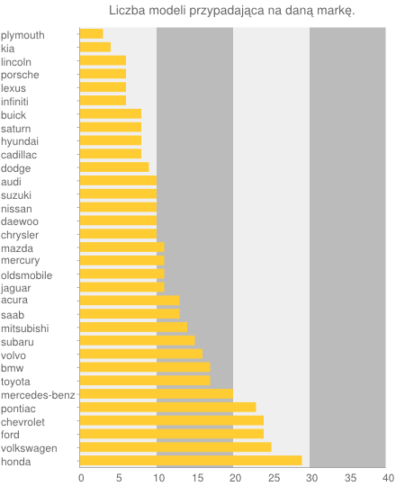
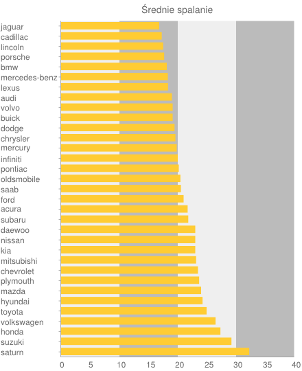

KODY_POCZTOWE
=============

### *Marcin Gigołło*


Dane dotyczą miast w których jest mniej niż 100 obszarów doręczeń.

1) Dane do oczyszczenia można pobrać ze [strony](http://pl.wikisource.org/wiki/Lista_kod%C3%B3w_pocztowych_w_Polsce/%C5%9Arednie_miasta). 

2) Dane zostały oczyszczone narzędziem  "Google Refine", dostępnym na [stronie](https://code.google.com/p/google-refine/).

Opis działania.

- Należy pobrać narzędzie Google Refine. 
- Pobrać wybrane przez siebie dane i zapisać w pliku tekstowym. 
- Uruchomić narzędzie google refine i wczytać plik tekstowy. 
- Dane oczyścić.
- Wynik eksportować do pliku.json


Przykładowe dane:
```json
 {
      "Miasto" : "Jelenia Góra",
      "Oddział" : "Instytucja Rejonowy Urząd Poczty w Jeleniej Górze",
      "Lokalizacja" : " ul. Pocztowa 9/10",
      "Kod" : "58-500"
    }
    {
      "Miasto" : "Jelenia Góra",
      "Oddział" : "Poczta Jelenia Góra 001",
      "Lokalizacja" : " ul. Pocztowa 9/10",
      "Kod" : "58-500"
    }
    {
      "Miasto" : "Jelenia Góra",
      "Oddział" : "Poczta Jelenia Góra 003",
      "Lokalizacja" : " ul. Wolności 58",
      "Kod" : "58-501"
    }
```

Oczyszczone dane znajdują się tu: [dane_6i6ant.json](/data/json/dane_6i6ant.json).


# Agregacje


1\. Ilość modeli samochodów przypadająca na poszczególne marki. Sortowane malejąco.

```js
collection.aggregate([
	{ $group : {
		_id : "$make",
		suma : {$sum: 1}
	}},
	{ $sort : { suma : -1 }
	},
	
	], function(err, result) {
		console.dir(result);
		//client.close();
	});
```
Wynik agregacji:

```js
[ { _id: 'honda', suma: 29 },
  { _id: 'volkswagen', suma: 25 },
  { _id: 'ford', suma: 24 },
  { _id: 'chevrolet', suma: 24 },
  { _id: 'pontiac', suma: 23 },
  { _id: 'mercedes-benz', suma: 20 },
  { _id: 'toyota', suma: 17 },
  { _id: 'bmw', suma: 17 },
  { _id: 'volvo', suma: 16 },
  { _id: 'subaru', suma: 15 },
  { _id: 'mitsubishi', suma: 14 },
  { _id: 'saab', suma: 13 },
  { _id: 'acura', suma: 13 },
  { _id: 'jaguar', suma: 11 },
  { _id: 'oldsmobile', suma: 11 },
  { _id: 'mercury', suma: 11 },
  { _id: 'mazda', suma: 11 },
  { _id: 'chrysler', suma: 10 },
  { _id: 'daewoo', suma: 10 },
  { _id: 'nissan', suma: 10 },
  { _id: 'suzuki', suma: 10 },
  { _id: 'audi', suma: 10 },
  { _id: 'dodge', suma: 9 },
  { _id: 'cadillac', suma: 8 },
  { _id: 'hyundai', suma: 8 },
  { _id: 'saturn', suma: 8 },
  { _id: 'buick', suma: 8 },
  { _id: 'infiniti', suma: 6 },
  { _id: 'lexus', suma: 6 },
  { _id: 'porsche', suma: 6 },
  { _id: 'lincoln', suma: 6 },
  { _id: 'kia', suma: 4 },
  { _id: 'plymouth', suma: 3 } ]
```

Graficzna reprezentacja danych: 




2\. Ilość modeli z automatyczną oraz manualną skrzynią biegów.

```js
	collection.aggregate([
	{ $group : {
		_id : "$transmission",
		suma : {$sum: 1}
	}},
	{ $sort : { suma : -1 }
	},
	
	], function(err, result) {
		console.dir(result);
		client.close();
	});
```
Wynik agregacji:

```js
[ { _id: 'manual', suma: 245 },
  { _id: 'automatic', suma: 171 } ]
```

3\. Agregacja dotycząca średniego spalania wszystkich modeli samochodów poszczególnych marek. 

```js
collection.aggregate([
    {$group : {_id : "$make", mpg_city: {$avg: "$mpg_city"}}},
    {$project : {_id: 0, producent: "$_id", mpg_city: "$mpg_city"}},
    { $sort : { mpg_city : -1 }},
    ], 


	function(err, result) {
        console.dir(result);
     //  client.close();
    });
```
Wynik agregacji:

```js
[ { mpg_city: 32.25, producent: 'saturn' },
  { mpg_city: 29.2, producent: 'suzuki' },
  { mpg_city: 27.310344827586206, producent: 'honda' },
  { mpg_city: 26.48, producent: 'volkswagen' },
  { mpg_city: 24.941176470588236, producent: 'toyota' },
  { mpg_city: 24.25, producent: 'hyundai' },
  { mpg_city: 24, producent: 'mazda' },
  { mpg_city: 23.666666666666668, producent: 'plymouth' },
  { mpg_city: 23.458333333333332, producent: 'chevrolet' },
  { mpg_city: 23.142857142857142, producent: 'mitsubishi' },
  { mpg_city: 23, producent: 'kia' },
  { mpg_city: 23, producent: 'nissan' },
  { mpg_city: 23, producent: 'daewoo' },
  { mpg_city: 21.8, producent: 'subaru' },
  { mpg_city: 21.692307692307693, producent: 'acura' },
  { mpg_city: 21, producent: 'ford' },
  { mpg_city: 20.53846153846154, producent: 'saab' },
  { mpg_city: 20.454545454545453, producent: 'oldsmobile' },
  { mpg_city: 20.17391304347826, producent: 'pontiac' },
  { mpg_city: 20, producent: 'infiniti' },
  { mpg_city: 19.818181818181817, producent: 'mercury' },
  { mpg_city: 19.6, producent: 'chrysler' },
  { mpg_city: 19.444444444444443, producent: 'dodge' },
  { mpg_city: 19.125, producent: 'buick' },
  { mpg_city: 19.125, producent: 'volvo' },
  { mpg_city: 19, producent: 'audi' },
  { mpg_city: 18.333333333333332, producent: 'lexus' },
  { mpg_city: 18.3, producent: 'mercedes-benz' },
  { mpg_city: 18.11764705882353, producent: 'bmw' },
  { mpg_city: 17.666666666666668, producent: 'porsche' },
  { mpg_city: 17.5, producent: 'lincoln' },
  { mpg_city: 17.25, producent: 'cadillac' },
  { mpg_city: 16.818181818181817, producent: 'jaguar' } ]
```
Graficzna reprezentacja danych: 



Dane wykorzystane do agregacji: [car_market.json](/data/json/car_market.json).
Skrypt: [link](/scripts/javascript/6i6ant_samochody_agregacje.js).


