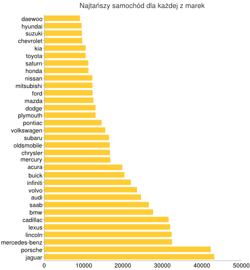
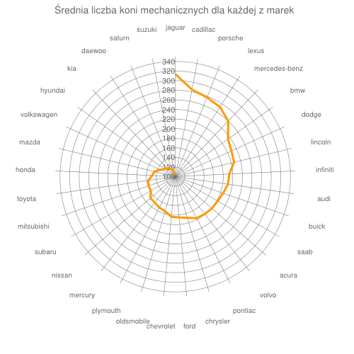
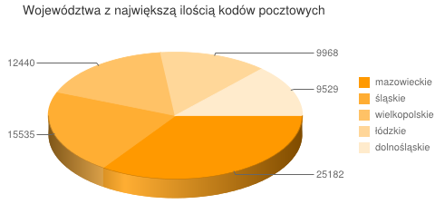

Lista bazylik na świecie
==========================

### *Alicja Kopczyńska*

Dane surowe dostępne na stronie [Wikipedii](http://en.wikipedia.org/wiki/List_of_basilicas), zostały oczyszczone narzędziem [Google Refine](http://code.google.com/p/google-refine/). 

Opis działania:

- pobranie surowych danych ze strony: [Wikipedia](http://en.wikipedia.org/wiki/List_of_basilicas)
- wczytanie pliku tekstowego do Google Refine
- oczyszczenie danych
- eksport danych do pliku JSON

Przykładowe dane:

```json
    {
      "continent" : "Asia",
      "country" : "China",
      "city" : "Shanghai",
      "basilica" : "She Shan Basilica",
      "year_of_designation" : "1942"
    }
    {
      "continent" : "Asia",
      "country" : "India",
      "city" : "Alleppey",
      "basilica" : "St. Andrew's Basilica",
      "year_of_designation" : "2010"
    }
    {
      "continent" : "Asia",
      "country" : "India",
      "city" : "Angamaly",
      "basilica" : "St. George Basilica",
      "year_of_designation" : "2009"
    }
    {
      "continent" : "Asia",
      "country" : "India",
      "city" : "Bandel",
      "basilica" : "Bandel Church",
      "year_of_designation" : "1988"
    }
    {
      "continent" : "Asia",
      "country" : "India",
      "city" : "Bangalore",
      "basilica" : "St. Mary's Basilica",
      "year_of_designation" : "1973"
    }
    {
      "continent" : "Asia",
      "country" : "India",
      "city" : "Chennai",
      "basilica" : "San Thome Basilica",
      "year_of_designation" : "1956"
    }
```
Oczyszczone dane znajdują się tu: [dane_alka74a.json](https://github.com/alka74a/data-refine/blob/master/data/json/dane_alka74a.json)


# Przykładowe agregacje


1\. Agregacja pokazująca najtańszy samochód dla każdej z marek.

```js
collection.aggregate([
	{$group : {_id : "$make", min_cena: {$min: "$price"}, }},
	{$project : {_id: 0, marka: "$_id",min_cena: "$min_cena"}},
	{$sort : { min_cena : 1 }},
	]);

```
wynik agregacji:

```js
[ { min_cena: 8999, marka: 'daewoo' },
  { min_cena: 9434, marka: 'hyundai' },
  { min_cena: 9499, marka: 'suzuki' },
  { min_cena: 9585, marka: 'chevrolet' },
  { min_cena: 10445, marka: 'kia' },
  { min_cena: 10450, marka: 'toyota' },
  { min_cena: 11125, marka: 'saturn' },
  { min_cena: 11165, marka: 'honda' },
  { min_cena: 12169, marka: 'nissan' },
  { min_cena: 12182, marka: 'mitsubishi' },
  { min_cena: 12200, marka: 'ford' },
  { min_cena: 12420, marka: 'mazda' },
  { min_cena: 12970, marka: 'dodge' },
  { min_cena: 12970, marka: 'plymouth' },
  { min_cena: 14515, marka: 'pontiac' },
  { min_cena: 15425, marka: 'volkswagen' },
  { min_cena: 16390, marka: 'subaru' },
  { min_cena: 16555, marka: 'oldsmobile' },
  { min_cena: 16625, marka: 'chrysler' },
  { min_cena: 16705, marka: 'mercury' },
  { min_cena: 19755, marka: 'acura' },
  { min_cena: 20285, marka: 'buick' },
  { min_cena: 21920, marka: 'infiniti' },
  { min_cena: 23475, marka: 'volvo' },
  { min_cena: 24515, marka: 'audi' },
  { min_cena: 26475, marka: 'saab' },
  { min_cena: 27560, marka: 'bmw' },
  { min_cena: 31500, marka: 'cadillac' },
  { min_cena: 31900, marka: 'lexus' },
  { min_cena: 32275, marka: 'lincoln' },
  { min_cena: 32395, marka: 'mercedes-benz' },
  { min_cena: 42195, marka: 'porsche' },
  { min_cena: 43095, marka: 'jaguar' } ]

```

Graficzna reprezentacja danych: 



2\. Agregacja pokazująca średnią liczbę koni mechanicznych dla każej z marek.

```js
collection.aggregate([
	{ $group : { _id : "$make", horse_power: {$avg: "$horse_power"}}},
	{$project : { _id: 0, make: "$_id", horse_power: "$horse_power" }},
	{ $sort : { horse_power : -1 }},
	]);
```

wynik agregacji:

```js
[ { horse_power: 313.72727272727275, make: 'jaguar' },
  { horse_power: 284.625, make: 'cadillac' },
  { horse_power: 277.8333333333333, make: 'porsche' },
  { horse_power: 272.5, make: 'lexus' },
  { horse_power: 259.95, make: 'mercedes-benz' },
  { horse_power: 235.05882352941177, make: 'bmw' },
  { horse_power: 228.66666666666666, make: 'dodge' },
  { horse_power: 226.16666666666666, make: 'lincoln' },
  { horse_power: 212.66666666666666, make: 'infiniti' },
  { horse_power: 211, make: 'audi' },
  { horse_power: 205.625, make: 'buick' },
  { horse_power: 201.92307692307693, make: 'saab' },
  { horse_power: 201.07692307692307, make: 'acura' },
  { horse_power: 199.125, make: 'volvo' },
  { horse_power: 197.3913043478261, make: 'pontiac' },
  { horse_power: 189.3, make: 'chrysler' },
  { horse_power: 185.41666666666666, make: 'ford' },
  { horse_power: 184.08333333333334, make: 'chevrolet' },
  { horse_power: 175, make: 'oldsmobile' },
  { horse_power: 172.33333333333334, make: 'plymouth' },
  { horse_power: 168.63636363636363, make: 'mercury' },
  { horse_power: 168.3, make: 'nissan' },
  { horse_power: 158.86666666666667, make: 'subaru' },
  { horse_power: 158.42857142857142, make: 'mitsubishi' },
  { horse_power: 156.64705882352942, make: 'toyota' },
  { horse_power: 148.06896551724137, make: 'honda' },
  { horse_power: 144.72727272727272, make: 'mazda' },
  { horse_power: 134.68, make: 'volkswagen' },
  { horse_power: 126.875, make: 'hyundai' },
  { horse_power: 125, make: 'kia' },
  { horse_power: 119.7, make: 'daewoo' },
  { horse_power: 116.625, make: 'saturn' },
  { horse_power: 103.7, make: 'suzuki' } ]

```

Graficzna reprezentacja danych:




3\. Agregacja pokazująca 5 województw z największą liczbą kodów pocztowych.

```js
collection.aggregate([{$group : {_id : "$wojewodztwo",ilosc_kodow: {$sum: 1},}},
	{$project : { _id: 0, wojewodztwo: "$_id", ilosc_kodow :  1}},
	{$sort : { ilosc_kodow : -1  }},
	{$limit : 5 }
	]);
```
	
wynik agregacji:

```js

[ { ilosc_kodow: 25182, wojewodztwo: 'mazowieckie' },
  { ilosc_kodow: 15535, wojewodztwo: 'śląskie' },
  { ilosc_kodow: 12440, wojewodztwo: 'wielkopolskie' },
  { ilosc_kodow: 9968, wojewodztwo: 'łódzkie' },
  { ilosc_kodow: 9529, wojewodztwo: 'dolnośląskie' } ]

```
Graficzna reprezentacja danych:



