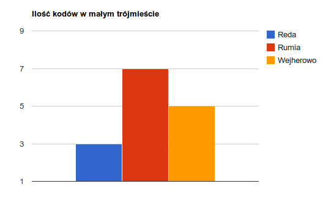
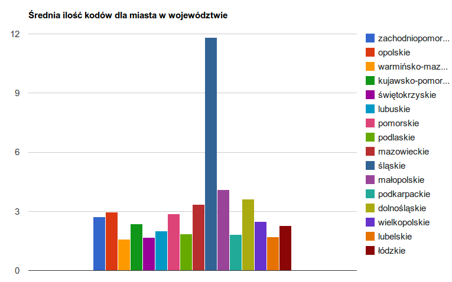
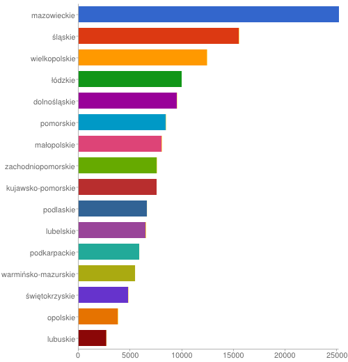

# Kody pocztowe

### *Adam Radomski*

Plik: http://piotr.eldora.pl/weblog/wp-content/plugins/download-monitor/download.php?id=8


## Co zostało zrobione?
Plik pobrany wyeksportowany z sql do csv. Następnie wrzucony do google refine tam poprawiony (zmiana nazw kolumn wyrzucony timestamp).

## Przykładowy dokument i ilość:
```js
{
    "id": 1,
    "kod": "00-001",
    "nazwa": "FUP Warszawa 1",
    "miejscowosc": "Warszawa (Śródmieście)",
    "wojewodztwo": "mazowieckie",
    "adres": "Al. Jana Pawła II",
    "powiat": "m. st. Warszawa",
    "zakres": "numer 82",
    "gmina": "M. st. Warszawa"
}
```


# Aggregation

* [Biblioteka potrzebna do obsługi json](http://code.google.com/p/google-gson/)


* Ilość kodów pocztowych w Małym Trójmieście
```Java
	DBObject match = new BasicDBObject("$match", new BasicDBObject(
				"miejsce", new BasicDBObject("$in", new String[] { "Rumia",
						"Reda", "Wejherowo" })));
	DBObject sumFields = new BasicDBObject("_id", "$miejsce");
	sumFields.put("count_field", new BasicDBObject("$sum", 1));
	DBObject sum = new BasicDBObject("$group", sumFields);

		AggregationOutput output = coll.aggregate(match, sum);
```

```Json
{
  "serverUsed": "/153.19.1.202:27017",
  "result": [
    {
      "_id": "Reda",
      "count_field": 3.0
    },
    {
      "_id": "Rumia",
      "count_field": 7.0
    },
    {
      "_id": "Wejherowo",
      "count_field": 5.0
    }
  ],
  "ok": 1.0
}
```


* Średnia ilość kodów dla miasta w województwie

```Java
	DBObject fields = new BasicDBObject("wojewodztwo", "$wojewodztwo");
	fields.put("miejsce", "$miejsce");
	DBObject groupFields = new BasicDBObject("_id", fields);
	groupFields.put("count_field", new BasicDBObject("$sum", 1));
	DBObject group = new BasicDBObject("$group", groupFields);
	DBObject avgFields = new BasicDBObject("_id", "$_id.wojewodztwo");
	avgFields
			.put("avg_zipcodes", new BasicDBObject("$avg", "$count_field"));
	DBObject avg = new BasicDBObject("$group", avgFields);
	AggregationOutput output = coll.aggregate(group, avg);
```

```Json
{
  "serverUsed": "/153.19.1.202:27017",
  "result": [
    {
      "_id": "zachodniopomorskie",
      "avg_zipcodes": 2.726781857451404
    },
    {
      "_id": "opolskie",
      "avg_zipcodes": 2.954404945904173
    },
    {
      "_id": "warmińsko-mazurskie",
      "avg_zipcodes": 1.5839860748476937
    },
    {
      "_id": "kujawsko-pomorskie",
      "avg_zipcodes": 2.361189358372457
    },
    {
      "_id": "świętokrzyskie",
      "avg_zipcodes": 1.6755910987482614
    },
    {
      "_id": "lubuskie",
      "avg_zipcodes": 2.002235469448584
    },
    {
      "_id": "pomorskie",
      "avg_zipcodes": 2.884339815762538
    },
    {
      "_id": "podlaskie",
      "avg_zipcodes": 1.8515406162464987
    },
    {
      "_id": "mazowieckie",
      "avg_zipcodes": 3.34466728649223
    },
    {
      "_id": "śląskie",
      "avg_zipcodes": 11.822678843226788
    },
    {
      "_id": "małopolskie",
      "avg_zipcodes": 4.113775510204082
    },
    {
      "_id": "podkarpackie",
      "avg_zipcodes": 1.8385579937304075
    },
    {
      "_id": "dolnośląskie",
      "avg_zipcodes": 3.6081029912911777
    },
    {
      "_id": "wielkopolskie",
      "avg_zipcodes": 2.4974904637622966
    },
    {
      "_id": "lubelskie",
      "avg_zipcodes": 1.7104642014162077
    },
    {
      "_id": "łódzkie",
      "avg_zipcodes": 2.283619702176403
    }
  ],
  "ok": 1.0
}
```


* Ilość kodów w województwie

```Java
DBObject groupFields = new BasicDBObject("_id", "$wojewodztwo");
		groupFields.put("count_field", new BasicDBObject("$sum", 1));
		DBObject group = new BasicDBObject("$group", groupFields);
		DBObject sort = new BasicDBObject("$sort", new BasicDBObject(
				"count_field", -1));
		AggregationOutput output = coll.aggregate(group, sort);
```
```Json
{
  "serverUsed": "/153.19.1.202:27017",
  "result": [
    {
      "_id": "mazowieckie",
      "count_field": 25182.0
    },
    {
      "_id": "śląskie",
      "count_field": 15535.0
    },
    {
      "_id": "wielkopolskie",
      "count_field": 12440.0
    },
    {
      "_id": "łódzkie",
      "count_field": 9968.0
    },
    {
      "_id": "dolnośląskie",
      "count_field": 9529.0
    },
    {
      "_id": "pomorskie",
      "count_field": 8454.0
    },
    {
      "_id": "małopolskie",
      "count_field": 8063.0
    },
    {
      "_id": "zachodniopomorskie",
      "count_field": 7575.0
    },
    {
      "_id": "kujawsko-pomorskie",
      "count_field": 7544.0
    },
    {
      "_id": "podlaskie",
      "count_field": 6610.0
    },
    {
      "_id": "lubelskie",
      "count_field": 6522.0
    },
    {
      "_id": "podkarpackie",
      "count_field": 5865.0
    },
    {
      "_id": "warmińsko-mazurskie",
      "count_field": 5460.0
    },
    {
      "_id": "świętokrzyskie",
      "count_field": 4819.0
    },
    {
      "_id": "opolskie",
      "count_field": 3823.0
    },
    {
      "_id": "lubuskie",
      "count_field": 2687.0
    }
  ],
  "ok": 1.0
}
```


* Ilość kodów pocztowych w mieście 

```Java
        DBObject fields = new BasicDBObject("wojewodztwo", "$wojewodztwo");
	fields.put("miejsce", "$miejsce");
	DBObject groupFields = new BasicDBObject("_id", fields);
	groupFields.put("count_field", new BasicDBObject("$sum", 1));
	DBObject group = new BasicDBObject("$group", groupFields);
``` 

