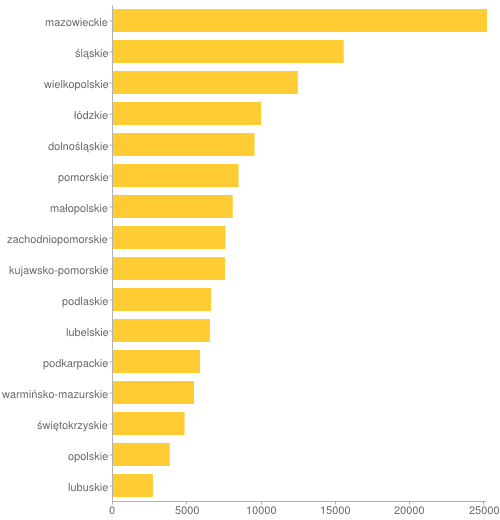
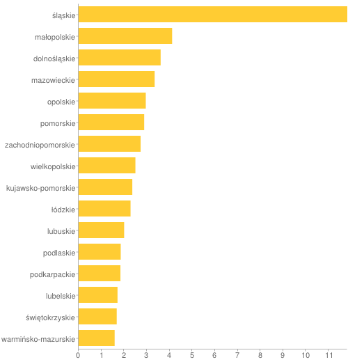
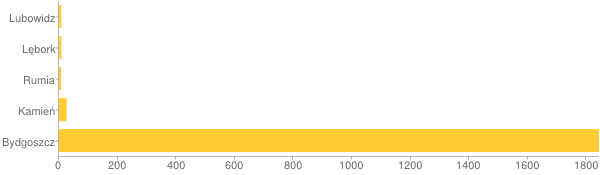
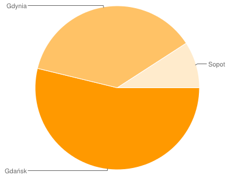
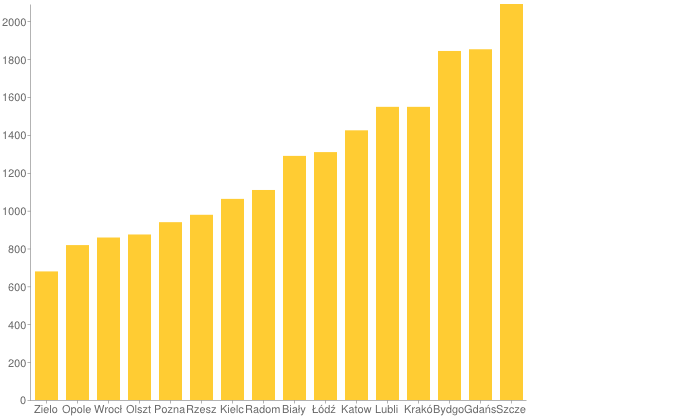

# Kody pocztowe

### *Dorian Sawa*

Oryginalny plik z danymi do pobrania przez:
`wget -O kody_pocztowe.csv.bz2 http://piotr.eldora.pl/weblog/wp-content/plugins/download-monitor/download.php?id=7`

## Co zostało zrobione?
1. Pobrano oryginalny plik CSV, kody pocztowe GUS.
* Przeczyszczono dane przy użyciu Google-Refine (głównie usunięto zbędne kolumny, czy zmieniono ich nazwe).
* Export z Google-Refine danych do postaci JSON.
* Export odbył się do pliku .txt, więc poprawiono plik na .json, dopasowany do importu do bazy.
* Rozdzielenie pliku .json na 2 pomniejsze, gdyż pojedyńczy był za duży dla mongoimport.
* Zaimportowanie do lokalnej bazy:
 * Użycie mojego skryptu (importer) z [mongo-easy-scripts](https://github.com/dsawa/mongo-easy-scripts)
 * Ewentualnie: `mongoimport --db nosql --collection zipcodes --type json --file zipcodes_part3.json --jsonArray`

## Oczyszczone JSON-y w postaci (jednolinijkowej):

```json
{
  "kod": "71-212", 
  "miejsce": "Szczecin", 
  "ulica": "Ul. Janka Muzykanta", 
  "zakres": "numery od 1 do końca obie strony", 
  "wojewodztwo": "zachodniopomorskie", 
  "powiat": "m. szczecin", 
  "gmina": "M. Szczecin"
}
```

## Przykładowy dokument po zaimportowaniu do bazy oraz ilość wszystkich:
```
> db.zipcodes.count()
140076
> db.zipcodes.find().limit(1).pretty()
{
      "_id" : ObjectId("513f837e98971044ab940b22"),
	"kod" : "06-410",
	"miejsce" : "Ciechanów",
	"ulica" : "Ul. Jastruna Mieczysława",
	"zakres" : "numery od 1 do końca obie strony",
	"wojewodztwo" : "mazowieckie",
	"powiat" : "ciechanowski",
	"gmina" : "Ciechanów"
}
```
* Oczyszczone JSONy z racji wagi do ściągnięcia z dropboxa:
[Klik](https://www.dropbox.com/sh/6rq54na5velgqxr/v4FkNM-eXO)

## Agregacje - skrypt w Ruby
Skrypt można podejrzeć pod poniższym linkiem:
[Klik](../scripts/ruby/aggregations_dsawa.rb)

Uruchamiając skrypt można wybrać do jakiej bazy danych się połączyć i jakiego hosta. 
Dodatkowo, dla własnej wygody zrobiłem, żeby skrypt zbierał litere jako parametr i wybór hosta 
odbywał się szybciej. Nie podając, żadnych parametrów skrypt zapyta co zrobić.

Przykłady użycia:

1. Wyświetlenie dialogu, pytającego co użytkownik chce zrobić:
`
ruby scripts/ruby/aggregations_dsawa.rb
`
* host: localhost, baza: nosql, kolekcja: zipcodes
`
ruby scripts/ruby/aggregations_dsawa.rb d
`
* host: 153.19.1.202 (sigma), baza: test, kolekcja: kody_pocztowe
`
ruby scripts/ruby/aggregations_dsawa.rb s
`

Do łączenia z bazami wykorzystałem  [mongo-ruby-driver](https://github.com/mongodb/mongo-ruby-driver)

Łączenie następuje w poniższy sposób:
```ruby
db = MongoClient.new(host, port, w: 1, wtimeout: 200, j: true).db(db)
db.authenticate('student', 'sesja2013') if sigma
```
Jak widać, w przypadku ,gdy nie chcemy się łączyć lokalnie to standardowe dane do autentykacji są podawane.

## Agregacje (kod) 
Po połączeniu można przystąpić do agregowania danych.

* Zebranie ilości wpisów o kodach dla każdego województwa. Ostateczny wynik jest sortowany po tej ilości DESC.

```ruby
voivoidships_grouped = zipcodes.aggregate([
  { '$group' =>
    { :_id => '$wojewodztwo', count_field => { '$sum' => 1 } } },
  { '$project' => { :_id => 0, :voivoidship => '$_id', count_field => 1 } },
  { '$sort' => { count_field => -1 } }
])
```
* Średnia ilość wpisów dla miasta wg województw.

```ruby
cities_avg = zipcodes.aggregate([
  { '$group' =>
    { :_id => { :wojewodztwo => '$wojewodztwo', :miejsce => '$miejsce' },
      count_field => { '$sum' => 1 }
    }
  },
  { '$group' =>
    { :_id => '$_id.wojewodztwo', :avg_zipcodes => { '$avg' => '$' + count_field } }
  },
  { '$sort' => { :avg_zipcodes => -1 } },
  { '$project' => { :_id => 0, :avg_zipcodes => 1, :voivoidship => '$_id' } }
])
```

* Znalezienie kodów pocztowych zaczynających sie na 84 lub 85, gdzie liczba wpisów większa od 5. Użycie $match z regexpem.

```ruby
zipcodes_regex = zipcodes.aggregate([{ '$match' => { :kod => /8[45]-\d{3}/ } },
  { '$group' => { :_id => '$miejsce', count_field => { '$sum' => 1 } } },
  { '$match' => { count_field => { '$gt' => 5 } } },
  { '$project' => { :_id => 0, :city => '$_id', count_field => 1 } }
])
```

* Znalezienie miast Trójmiasta i liczbę ich kodów pocztowych (wpisów), zwracane alfabetycznie. Użycie $match oraz $in.

```ruby
zipcodes_tricity = zipcodes.aggregate([
  { '$match' => { :miejsce => { '$in' => %w(Gdynia Sopot Gdańsk) } } },
  { '$group' => { :_id => '$miejsce', count_field => { '$sum' => 1 } } },
  { '$project' => { :_id => 0, :city => '$_id', count_field => 1 } },
  { '$sort' => { :city => 1 } }
])
```

* Miejsca z największą ilością wpisów o kodach pocztowych w danym województwie.

```ruby
top_voivoidship_places = zipcodes.aggregate([
  { '$group' =>
    { :_id => { :wojewodztwo => '$wojewodztwo', :miejsce => '$miejsce' },
      count_field => { '$sum' => 1 }
    }
  },
  { '$sort' => { count_field => -1 } },
  { '$group' =>
    { :_id => '$_id.wojewodztwo',
      :place => { '$first' => '$_id.miejsce' },
      count_field => { '$first' => '$' + count_field }
    }
  },
  { '$sort' => { :_id => 1 } },
  { '$project' =>
    { :_id => 0, :voivoidship => '$_id', :place => 1, count_field => 1 } }
])
```

* Wyszukanie gminy z najwiekszą ilością wpisów o kodach pocztowych.

```ruby  
common_county = zipcodes.aggregate([
  { '$group' =>
    { :_id => { :wojewodztwo => '$wojewodztwo', :kod => '$kod', :gmina => '$gmina' },
      count_field => { '$sum' => 1 } }
  }, { '$sort' => { count_field => -1 } },
  { '$limit' => 1 },
  { '$project' =>
    { :_id => 0, count_field => 1, :voivoidship => '$_id.wojewodztwo', :county => '$_id.gmina' } }
]).first
```

## Agregacje (wyniki).
Wszystkie wyniki są zapisywane do tablic, które są iterowane w celu czytelnej prezentacji wyników.

* Zebranie ilości wpisów o kodach dla każdego województwa. Ostateczny wynik jest sortowany po tej ilości DESC.

```
Województwo: mazowieckie, 25182 wpisów.
Województwo: śląskie, 15535 wpisów.
Województwo: wielkopolskie, 12440 wpisów.
Województwo: łódzkie, 9968 wpisów.
Województwo: dolnośląskie, 9529 wpisów.
Województwo: pomorskie, 8454 wpisów.
Województwo: małopolskie, 8063 wpisów.
Województwo: zachodniopomorskie, 7575 wpisów.
Województwo: kujawsko-pomorskie, 7544 wpisów.
Województwo: podlaskie, 6610 wpisów.
Województwo: lubelskie, 6522 wpisów.
Województwo: podkarpackie, 5865 wpisów.
Województwo: warmińsko-mazurskie, 5460 wpisów.
Województwo: świętokrzyskie, 4819 wpisów.
Województwo: opolskie, 3823 wpisów.
Województwo: lubuskie, 2687 wpisów.
```



* Średnia ilość wpisów dla miasta wg województw.

```
Miasto w województwie: śląskie, posiada średnio 11.82 wpisów.
Miasto w województwie: małopolskie, posiada średnio 4.11 wpisów.
Miasto w województwie: dolnośląskie, posiada średnio 3.61 wpisów.
Miasto w województwie: mazowieckie, posiada średnio 3.34 wpisów.
Miasto w województwie: opolskie, posiada średnio 2.95 wpisów.
Miasto w województwie: pomorskie, posiada średnio 2.88 wpisów.
Miasto w województwie: zachodniopomorskie, posiada średnio 2.73 wpisów.
Miasto w województwie: wielkopolskie, posiada średnio 2.5 wpisów.
Miasto w województwie: kujawsko-pomorskie, posiada średnio 2.36 wpisów.
Miasto w województwie: łódzkie, posiada średnio 2.28 wpisów.
Miasto w województwie: lubuskie, posiada średnio 2.0 wpisów.
Miasto w województwie: podlaskie, posiada średnio 1.85 wpisów.
Miasto w województwie: podkarpackie, posiada średnio 1.84 wpisów.
Miasto w województwie: lubelskie, posiada średnio 1.71 wpisów.
Miasto w województwie: świętokrzyskie, posiada średnio 1.68 wpisów.
Miasto w województwie: warmińsko-mazurskie, posiada średnio 1.58 wpisów.
```


* Znalezienie kodów pocztowych zaczynających sie na 84 lub 85, gdzie liczba wpisów większa od 5. Użycie $match z regexpem.

```
Miasto: Lubowidz, 8 wpisów.
Miasto: Lębork, 8 wpisów.
Miasto: Rumia, 7 wpisów.
Miasto: Kamień, 26 wpisów.
Miasto: Bydgoszcz, 1843 wpisów.
```


* Znalezienie miast Trójmiasta i liczbę ich kodów pocztowych (wpisów), zwracane alfabetycznie. Użycie $match oraz $in.

```
Miasto: Gdańsk, 1852 wpisów.
Miasto: Gdynia, 1275 wpisów.
Miasto: Sopot, 315 wpisów.
```


* Miejsca z największą ilością wpisów o kodach pocztowych w danym województwie.

```
W województwie: dolnośląskie, najwięcej kodów ma: Wrocław (Wrocław-Fabryczna) (858).
W województwie: kujawsko-pomorskie, najwięcej kodów ma: Bydgoszcz (1843).
W województwie: lubelskie, najwięcej kodów ma: Lublin (1548).
W województwie: lubuskie, najwięcej kodów ma: Zielona Góra (679).
W województwie: mazowieckie, najwięcej kodów ma: Radom (1109).
W województwie: małopolskie, najwięcej kodów ma: Kraków (Kraków-Podgórze) (1548).
W województwie: opolskie, najwięcej kodów ma: Opole (818).
W województwie: podkarpackie, najwięcej kodów ma: Rzeszów (978).
W województwie: podlaskie, najwięcej kodów ma: Białystok (1289).
W województwie: pomorskie, najwięcej kodów ma: Gdańsk (1852).
W województwie: warmińsko-mazurskie, najwięcej kodów ma: Olsztyn (874).
W województwie: wielkopolskie, najwięcej kodów ma: Poznań (Poznań-Grunwald) (939).
W województwie: zachodniopomorskie, najwięcej kodów ma: Szczecin (2091).
W województwie: łódzkie, najwięcej kodów ma: Łódź (Łódź-Bałuty) (1309).
W województwie: śląskie, najwięcej kodów ma: Katowice (1424).
W województwie: świętokrzyskie, najwięcej kodów ma: Kielce (1062).
```


* Wyszukanie gminy z najwiekszą ilością wpisów o kodach pocztowych.

```
Najwięcej wpisów o kodach dotyczy gminy: Ostrów Wielkopolski, w województwie: wielkopolskie
```
