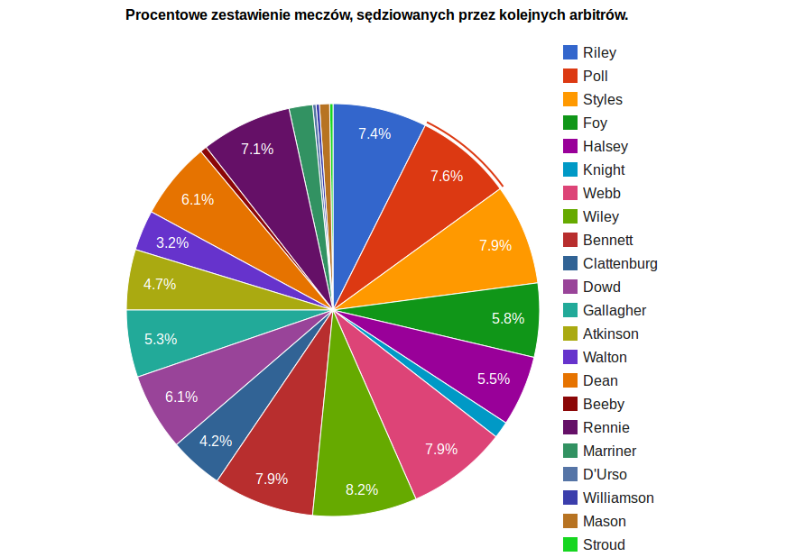
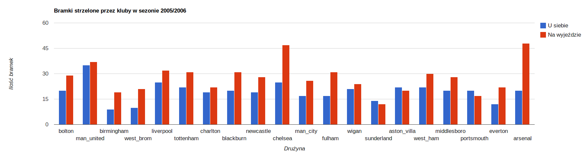

# Statystyki meczów angielskiej premier league

## Dane ze strony www.football-data.co.uk

[link](http://www.football-data.co.uk/data.php)

## Opis

* Pobranie danych w formacie csv
* Zaimportowanie danych do Google Refine
* Wyczyszczenie danych oraz edycja danych za pomocą Google Refine
* Eksport danych w formacie JSON

## Przykład danych w formacie JSON:

```json
{"Div":"E0","Date":"2005-08-13","HomeTeam":"aston_villa","AwayTeam":"bolton","Full_time_home_goals":2,"Full_time_away_goals":2,"Full_time_result":"D","Half_time_home_goals":2,"Half_time_away_goals":2,"Half_time_result":"D","Referee":"Riley","Home_shots":3,"Away_shots":13,"Home_shots_on_target":2,"Away_shots_on_target":6,"Home_fouls":14,"Away_fouls":16,"Home_corners":7,"Away_corners":8,"Home_yellows":0,"Away_yellows":2,"Home_reds":0,"Away_reds":0}
{"Div":"E0","Date":"2005-08-13","HomeTeam":"everton","AwayTeam":"man_united","Full_time_home_goals":0,"Full_time_away_goals":2,"Full_time_result":"A","Half_time_home_goals":0,"Half_time_away_goals":1,"Half_time_result":"A","Referee":"Poll","Home_shots":10,"Away_shots":12,"Home_shots_on_target":5,"Away_shots_on_target":5,"Home_fouls":15,"Away_fouls":14,"Home_corners":8,"Away_corners":6,"Home_yellows":3,"Away_yellows":1,"Home_reds":0,"Away_reds":0}
{"Div":"E0","Date":"2005-08-13","HomeTeam":"fulham","AwayTeam":"birmingham","Full_time_home_goals":0,"Full_time_away_goals":0,"Full_time_result":"D","Half_time_home_goals":0,"Half_time_away_goals":0,"Half_time_result":"D","Referee":"Styles","Home_shots":15,"Away_shots":7,"Home_shots_on_target":7,"Away_shots_on_target":4,"Home_fouls":12,"Away_fouls":13,"Home_corners":6,"Away_corners":6,"Home_yellows":1,"Away_yellows":2,"Home_reds":0,"Away_reds":0}

```

## Pliki:

[plik csv przed użyciem Google Refine] (/data/csv/league_dwisniewski.csv)
[Po użyciu Google Refine w formacie JSON](/data/json/football_dwisniewski.json)


## Diagramy wykonane przy użyciu Google Chart Tools





Wyszukiwanie lotnisk dla śmigłowców w Polsce.

```js
	db.airports.aggregate(
    	{$match: {iso_country: "PL", type: "heliport"}},
    	{$group: {_id: "$name"}}                     
	)

```

Wynik:

```js
{ "result" : [ { "_id" : "Kraków-Łęg Airport" } ], "ok" : 1 }
```

10 marek, których suma koni mechanicznych, wszystkich modeli jest największa.

```js
	db.car_market.aggregate(
	    {$group :{_id : "$make", horse : { $sum : "$horse_power"}}},
	    {$sort: {horse: -1}},
	    {$limit: 10}
	)
```

Wynik:

```js
	result" : [
    {
      "_id" : "mercedes-benz",
      "horse" : 5199
    },
    {
      "_id" : "pontiac",
      "horse" : 4540
    },
    {
      "_id" : "ford",
      "horse" : 4450
    },
    {
      "_id" : "chevrolet",
      "horse" : 4418
    },
    {
      "_id" : "honda",
      "horse" : 4294
    },
    {
      "_id" : "bmw",
      "horse" : 3996
    },
    {
      "_id" : "jaguar",
      "horse" : 3451
    },
    {
      "_id" : "volkswagen",
      "horse" : 3367
    },
    {
      "_id" : "volvo",
      "horse" : 3186
    },
    {
      "_id" : "toyota",
      "horse" : 2663
    }
  ],
  "ok" : 1
}

```