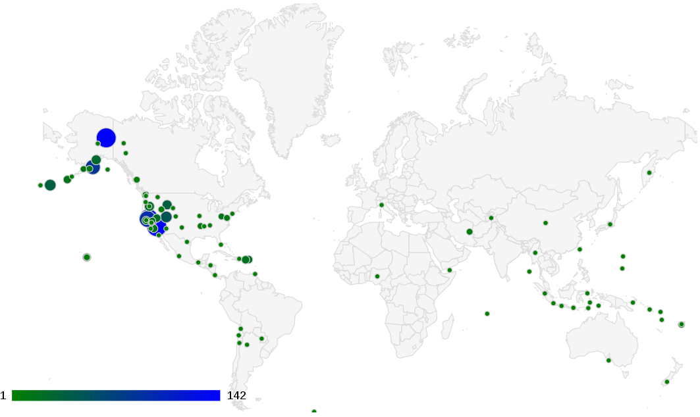
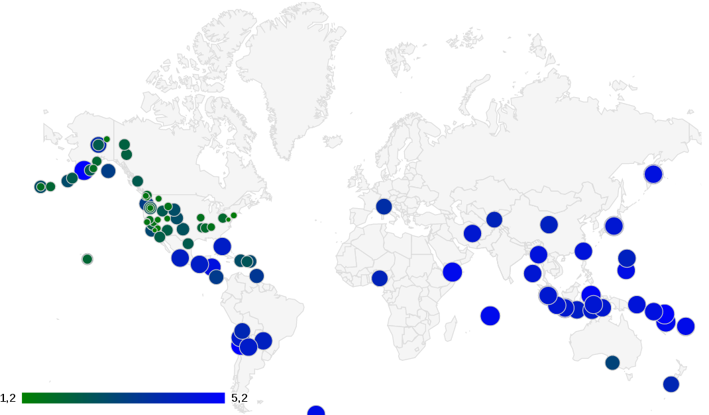
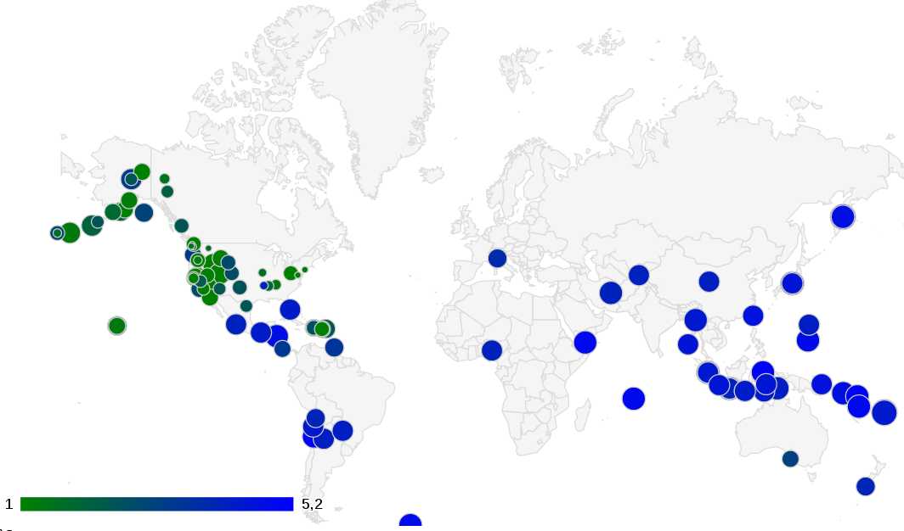

## Najniższe bezrobocie w Polsce
<<<<<<< HEAD
=======

>>>>>>> 731ebad6446722a4f79a55975ebf469763aa77b7
### *Jakub Ciechowski*

Dane ściągnąłem ze strony [GUS](http://www.stat.gov.pl/cps/rde/xbcr/gus/PW_bezrobotni_stopa_wg_powiat_01m_2013.xls)

## Opis
* plik oczyściłem oraz posortowałem korzystając z [Google refine](http://code.google.com/p/google-refine/)
* następnie wyeksportowałem do pliku JSON

## Przykładowe dane:
```
{ "Miasto": "Poznań", "bezrobotni w procentach": 4.5, "bezrobotni w tysiacach": 14.6 },
{ "Miasto": "Warszawa", "bezrobotni w procentach": 4.6, "bezrobotni w tysiacach": 52.2 },
```
* [plik JSON](/data/json/bezrobotni_jciechowski.json)

# Agregacje
----------------------------
Wykorzystałem dane opisujące trzęsienia ziemi z ostatnich 7 dni [U.S. Geological Survey](http://earthquake.usgs.gov/earthquakes/catalogs/eqs7day-M1.txt)

## Suma trzęsien ziemi w danych regionach

```
collection.aggregate([{
		$group: {
			_id: "$Region",
			total_earthquakes: {
				$sum: 1
			},
		}
	}, {
		$sort: {
			total_earthquakes: -1
		}
	}, ],
```
Wyniki:
```
{ _id: 'Central Alaska', total_earthquakes: 142 }
{ _id: 'Southern California', total_earthquakes: 138 }
{ _id: 'Northern California', total_earthquakes: 123 }
{ _id: 'Central California', total_earthquakes: 94 }
{ _id: 'Southern Alaska', total_earthquakes: 82 }
{ _id: 'Utah', total_earthquakes: 49 }
```


## Średnia siła trzęsień w regionie

```
collection.aggregate([{
		$group: {
			_id: {
				region: "$Region",
				lat: "$Lat"
			},
			magnitude: {
				$sum: "$Magnitude"
			}
		}
	}, {
		$group: {
			_id: "$_id.region",
			avgMagnitude: {
				$avg: "$magnitude"
			}
		}
	}, {
		$sort: {
			avgMagnitude: -1
		}
	}],
```
Wyniki:
```
{ _id: 'off the coast of Atacama, Chile', avgMagnitude: 5.2 },
{ _id: 'off the east coast of Honshu, Japan',avgMagnitude: 5.2 },
{ _id: 'Kamchatka Peninsula, Russia', avgMagnitude: 5.15 },
{ _id: 'south of Java, Indonesia', avgMagnitude: 5.1 },
{ _id: 'Santa Cruz Islands', avgMagnitude: 5.1 },
{ _id: 'off the coast of northern Peru', avgMagnitude: 5.1 },
{ _id: 'Molucca Sea', avgMagnitude: 5 },
```


## Najsilniejsze oraz najsłabsze trzęsienie w regionie
```
collection.aggregate([{
		$group: {
			_id: {
				Region: "$Region",
				Lon: "$Lon"
			},
			Magnitude: {
				$sum: "$Magnitude"
			}
		}
	}, {
		$sort: {
			Magnitude: 1
		}
	}, {
		$group: {
			_id: "$_id.Region",
			biggestMagnitude: {
				$last: "$Magnitude"
			},
			smallestMagnitude: {
				$first: "$Magnitude"
			}
		}
	}, {
		$sort: {
			biggestMagnitude: -1
		}
	}]
```
Wyniki:
```
{ _id: 'south of the Fiji Islands',
biggestMagnitude: 5.8,
smallestMagnitude: 4.4 },
{ _id: 'Kamchatka Peninsula, Russia',
biggestMagnitude: 5.5,
smallestMagnitude: 4.8 },
{ _id: 'off the east coast of Honshu, Japan',
biggestMagnitude: 5.4,
smallestMagnitude: 5 },
{ _id: 'off the west coast of northern Sumatra',
biggestMagnitude: 5.3,
smallestMagnitude: 4.7 },
{ _id: 'off the coast of Atacama, Chile',
biggestMagnitude: 5.2,
smallestMagnitude: 5.2 },
{ _id: 'southern Iran',
biggestMagnitude: 5.1,
smallestMagnitude: 4.1 },
{ _id: 'Santa Cruz Islands',
biggestMagnitude: 5.1,
smallestMagnitude: 5.1 },
```



