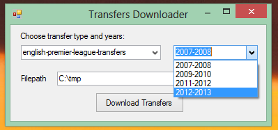

# Transfery zawodników piłki nożnej w latach 2007-2013

#### Autor: *Łukasz Kępiński*

##Źródło danych: 

http://www.soccernews.com/soccer-transfers/

## Co zrobiłem aby przygotować dane?

1. Stworzono aplikację w języku C# (.NET framework) do pobierania listy transferów w formie przystępnej dla GoogleRefine (linijka w linijkę).
1. Import plików do GoogleRefine (scalenie danych z 16 plików jednocześnie).
1. Oczyszczenie oraz segregacja danych do odpowiednich kolumn za pomocą narzędzia GoogleRefine.
1. Edycja kolumny z nazwami plików przy pomocy narzędzi GoogleRefine, tak aby zamiast kolumny z nazwą pliku utworzyć 2 kolumny - ligę oraz lata transferu (użycie 'facet', 'split column' oraz wyrażeń regularnych).
1. Ujednolicenie danych z kolumny "Price", tak aby każdy wpis z kwota byl formatu numerycznego.

### Screen z aplikacji, którą stworzyłem:



###Metoda 'wyciągająca' dane:

```java
/// <summary>
/// Get all transfers data as list of strings.
/// </summary>
/// <param name="htmlDocument">HTML document string representation.</param>
/// <returns>String list of data.</returns>
public List<String> GetTransfersData(string htmlDocument)
{
	// Data container.
	List<string> dataToSave = new List<string>();

	// Load downloaded website.
	HtmlAgilityPack.HtmlDocument htmlDoc = new HtmlAgilityPack.HtmlDocument();
	htmlDoc.LoadHtml(htmlDocument);

	// Find proper HTML element with transfers 'table'.
	HtmlAgilityPack.HtmlNode div = htmlDoc.DocumentNode.SelectSingleNode("//div[@class='panes']");

	// Get all players with data, each data element as separate list element.
	if (div != null)
	{
		dataToSave = div.Descendants("li")
					   .Select(a => a.InnerText)
					   .ToList();
	}
	else
	{
		throw new Exception("Could not find div with transfers!");
	}

	return dataToSave;
}
```

## Przykładowe rekordy:
```json
       {
      "Type" : "Italian Serie A",
      "Years" : "2012-2013",
      "Player" : "Thomas HeurtauxDefender",
      "Country" : "France",
      "To" : "Udinese",
      "From" : "Caen",
      "Price" : "2000000"
    },
    {
      "Type" : "Italian Serie A",
      "Years" : "2012-2013",
      "Player" : "Andrea LazzariMidfielder",
      "Country" : "Italy",
      "To" : "Udinese",
      "From" : "Fiorentina",
      "Price" : "Loan"
    },
	{
      "Type" : "English Premier League",
      "Years" : "2012-2013",
      "Player" : "Michael OwenAttacker",
      "Country" : "England",
      "To" : "Stoke",
      "From" : "Manchester Utd",
      "Price" : "Free"
    },
    {
      "Type" : "English Premier League",
      "Years" : "2012-2013",
      "Player" : "Brek Shea Goalkeeper",
      "Country" : "USA",
      "To" : "Stoke",
      "From" : "FC Dallas",
      "Price" : "2900000"
    }
```

#Agregacje

Import danych do bazy wykonany poprzez:

```json
lukasz@ubuntu:~/Dokumenty/Studia/noSql$ mongoimport --db transfersdb --collection transfers --type csv --file ~/Dokumenty/Studia/noSql/git/data-refine/data/csv/lkepinsk-soccer-transfers.csv --headerline --ignoreBlanks
connected to: 127.0.0.1
Tue May 28 22:12:46.659 		Progress: 8142/168111	4%
Tue May 28 22:12:46.659 			100	9/second
Tue May 28 22:12:46.673 check 9 2116
Tue May 28 22:12:46.700 imported 2115 objects
```

Zliczenie danych przyniosło następujący efekt: 

```json
db.transfers.count()
2115
```

Polacy, którzy zostali transferowani za darmo między klubami:

```json
db.transfers.group( { 
key: { Player: 1, From: 1, To: 1 }
, cond: { Price: "Free", Country: "Poland" }
, reduce: function ( curr, result ) { }
, initial: {} } )
[
	{
		"Player" : "Dariusz DudkaMidfielder",
		"From" : "Auxerre",
		"To" : "Levante"
	},
	{
		"Player" : "Artur BorucGoalkeeper",
		"From" : "Fiorentina",
		"To" : "Southampton"
	},
	{
		"Player" : "Ireneusz Jelen Attacker",
		"From" : "Auxerre",
		"To" : "Lille"
	}
]
```

Polacy transferowani za ponad 1 milion:

```json
db.transfers.group( { 
key: { Player: 1, From: 1, To: 1 }
, cond: { Price: {$gt: 1000000}
, Country: "Poland" }
, reduce: function ( curr, result ) { }
, initial: {} } )
[
	{
		"Player" : "Rafal Wolski Midfielder",
		"From" : "Legia Warsaw",
		"To" : "Fiorentina"
	},
	{
		"Player" : "Mateusz KlichMidfielder",
		"From" : "Cracovia",
		"To" : "Wolfsburg"
	}
]
```

Łączna suma pieniędzy jaką wydał klub Ajax na transfery w latach 2009-2010:

```json
db.transfers.group( { 
key: { To: 1 }
, cond: { To: "Ajax", Years: "2009-2010" }
, reduce: function ( curr, result ) { result.total_spent += curr.Price; }
, initial: { total_spent: 0 } } )
```


