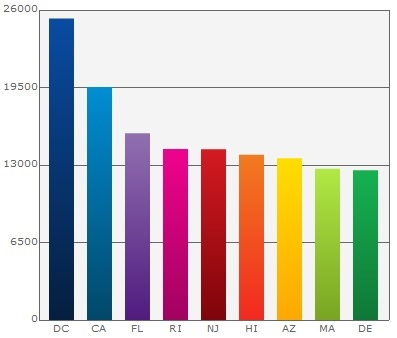
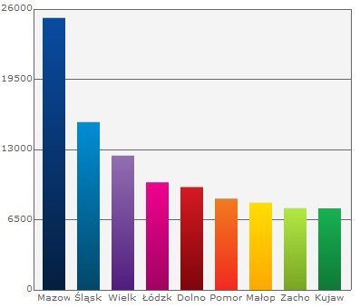
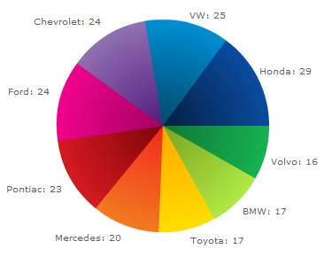

Dane statystyczne osÛb bezrobotnych
=============

##èrÛd≥o:

Dane pochodzπ ze strony : [http://www.stat.gov.pl/gus](http://www.stat.gov.pl/gus/5840_1487_PLK_HTML.htm).

##Proces oczyszczenia danych:

- do oczyszczenia danych uøy≥em google refine
- oczyszczenie wymaga≥o usuniÍcia zbÍdnych kolumn, usuniÍcia zbÍdnych wierszy, podmienienia numeracji wojewÛdztw nazwami, posortowania wojewÛdztwami
- po oczyszczeniu danych wyeksportowa≥em je do formatu CSV rÛwnieø poprzez google refine
- dane w formacie csv przekonwertowa≥em do formatu JSON poprzez: [www.cparker15.com](http://www.cparker15.com/code/utilities/csv-to-json)

##Moje Dane:

[Dane w formacie CSV](../data/csv/bezrobotni_mcholka.csv)

[Dane w formacie JSON](../data/json/bezrobotni_mcholka.json)

##Przyk≥adowe dane w formacie JSON:
```json
	{
		"wojewodztwo": "DOLNOåL•SKIE",
		"powiat": "m. Wroc≥aw",
		"ilosc": "20.5",
		"procent": "6.2"
	}
	{
		"wojewodztwo": "KUJAWSKO-POMORSKIE",
		"powiat": "Bydgoski",
		"ilosc": "5.6",
		"procent": "14.6"
	}
```

##Skrypt agregujπcy

Skrypt przedstawiajπcy przyk≥adowe agregacje zosta≥ zaimplementowany na 3 rÛønych bazach danych.
Skrypt zosta≥ napisany w jÍzyku java.
Tutaj dostÍpny jego kod ürÛd≥owy: [SKRYPT](../scripts/java/mcholka/SimpleAggregator.java)
Skrypt by≥ odpalany jako maven projekt, do jego zdalnego uruchomienia trzeba pobraÊ jary:

         <dependency>
             <groupId>org.mongodb</groupId>
             <artifactId>mongo-java-driver</artifactId>
             <version>2.11.0</version>
         </dependency>
         <dependency>
             <groupId>org.apache.commons</groupId>
             <artifactId>commons-io</artifactId>
             <version>1.3.2</version>
         </dependency>
         <dependency>
             <groupId>com.google.code.gson</groupId>
             <artifactId>gson</artifactId>
             <version>2.2.4</version>
         </dependency>
		 
Wyniki skryptu z kaødej agregacji sπ zapisywane na dysku w poprawnie sformatowanym pliku JSON.
Przyk≥adowy fragment:

```json
{
  "serverUsed": "/153.19.1.202:27017",
  "result": [
    {
      "_id": "honda",
      "numberOfModels": 29.0
    },
    {
      "_id": "volkswagen",
      "numberOfModels": 25.0
    },
    {
      "_id": "ford",
      "numberOfModels": 24.0
    }
  ],
  "ok": 1.0
}
```

##Wykresy przedstawiajπce wyniki agregacji

* Stany usa posortowane wed≥ug najwyøszej úredniej populacji powyøej 10000.



* WojewÛdztwa wed≥ug najwiÍkszej sumy kodÛw pocztowych



* Posortowane modele aut wed≥ug najwiÍkszej iloúci modeli w roku 2000



