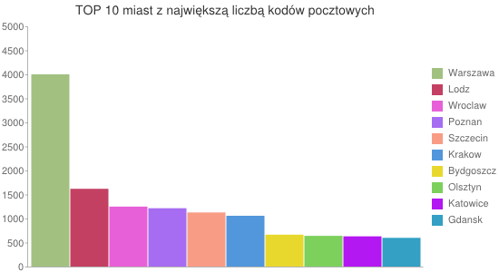
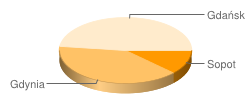

#Kody pocztowe

### by Marcin Glombiowski
-----
-----


Skrypt do pobierania kodów wraz z danymi(.json) oraz wersja .csv utworzona przy pomocy narzedzia google-refine.
Dane to kody-pocztowe gmin.


Skrypt php wykorzystuje api strony sejmometr.pl, po zarejestrowaniu sie na stronie, pobraniu kluczy sciagamy biblioteke do api (folder ep_API), osadzamy klucze. Po zalaczeniu biblioteki do skryptu mozemy juz korzystac z wszystkich funkcjonalnosci udostepnianych przez sejmometr.
[(Skrypt do wgladu)](../scripts/php/zips-mglombiowski.php)

----

###Fragment CSV:

```csv
kod,kod_int,liczba_gmin,wojewodztwo_id,liczba_powiatow,gminy,wojewodztwo,miejscowosci_str

00-002,2,1,7,1,Warszawa,mazowieckie,Warszawa (Sródmiescie)

00-003,3,1,7,1,Warszawa,mazowieckie,Warszawa (Sródmiescie)

00-004,4,1,7,1,Warszawa,mazowieckie,Warszawa (Sródmiescie)

00-005,5,1,7,1,Warszawa,mazowieckie,Warszawa (Sródmiescie)

00-006,6,1,7,1,Warszawa,mazowieckie,Warszawa (Sródmiescie)

00-007,7,1,7,1,Warszawa,mazowieckie,Warszawa (Sródmiescie)

00-008,8,1,7,1,Warszawa,mazowieckie,Warszawa (Sródmiescie)
```

[Pelna wersja CSV](../data/csv/zip_codes-mglombiowski.csv)

----

##Agregacje:

Na poczatek alias dla kolekcji:
```coll = db.zips```

Liczba wystapien róznych kodów w tym samym miescie (top 20):
```
coll.aggregate({ 
		$group: {_id: "$gminy", totalCount: {$sum: 1}} },{
 		$match: {totalCount: {$gte: 3}} },
	{ 
		$sort: {totalCount: -1}
	},
	{ 
		$limit: 20 
	}
)
```


####wynik:
```json
{
        "result" : [
                {
                        "_id" : "Warszawa",
                        "totalCount" : 4001
                },
                {
                        "_id" : "Lódz",
                        "totalCount" : 1618
                },
                {
                        "_id" : "Wroclaw",
                        "totalCount" : 1248
                },
                {
                        "_id" : "Poznan",
                        "totalCount" : 1214
                },
                {
                        "_id" : "Szczecin",
                        "totalCount" : 1126
                },
                {
                        "_id" : "Kraków",
                        "totalCount" : 1057
                },
                {
                        "_id" : "Bydgoszcz",
                        "totalCount" : 664
                },
                {
                        "_id" : "Olsztyn",
                        "totalCount" : 639
                },
                {
                        "_id" : "Katowice",
                        "totalCount" : 629
                },
                {
                        "_id" : "Gdansk",
                        "totalCount" : 598
                },
                {
                        "_id" : "Bialystok",
                        "totalCount" : 592
                },
                {
                        "_id" : "Lublin",
                        "totalCount" : 562
                },
                {
                        "_id" : "Kielce",
                        "totalCount" : 497
                },
                {
                        "_id" : "Gdynia",
                        "totalCount" : 497
                },
                {
                        "_id" : "Koszalin",
                        "totalCount" : 486
                },
                {
                        "_id" : "Opole",
                        "totalCount" : 476
                },
                {
                        "_id" : "Zielona Góra",
                        "totalCount" : 360
                },
                {
                        "_id" : "Sopot",
                        "totalCount" : 153
                },
                {
                        "_id" : "Rzeszów",
                        "totalCount" : 145
                },
                {
                        "_id" : "Radom",
                        "totalCount" : 13
                }
        ],
        "ok" : 1
}

```
###Link do wykresu

```
http://chart.googleapis.com/chart
?chxr=0,0,5000&chxt=y
&chbh=a,1,7
&chs=550x300
&cht=bvg&chtt=TOP+10+miast+z+najwi%C4%99ksz%C4%85+liczb%C4%85+kod%C3%B3w+pocztowych
&chdl=Warszawa|Lodz|Wroclaw|Poznan|Szczecin|Krakow|Bydgoszcz|Olsztyn|Katowice|Gdansk
&chco=A2C180,c34062,e860d8,a66cf2,f89c85,5297dc,e8d82d,7dd05b,b317f2,33a0c4
&chds=0,5000,0,5000,0,5000,0,5000,0,5000,0,5000,0,5000,0,5000,0,5000,0,5000
&chd=t:4001|1618|1248|1214|1126|1057|664|639|629|598
```

####Wykres




----

###Liczba kodów w kazdym z województw:
```
coll.aggregate(
	{
		$group: {
			_id : "$wojewodztwo", count: {$sum: 1}
			}

	}
	
)
```

####wyniki:
```json
{
        "result" : [
                {
                        "_id" : "kujawsko-pomorskie",
                        "count" : 872
                },
                {
                        "_id" : "lubuskie",
                        "count" : 490
                },
                {
                        "_id" : "warminsko-mazurskie",
                        "count" : 770
                },
                {
                        "_id" : "dolnoslaskie",
                        "count" : 1560
                },
                {
                        "_id" : "opolskie",
                        "count" : 627
                },
                {
                        "_id" : "lódzkie",
                        "count" : 1795
                },
                {
                        "_id" : "swietokrzyskie",
                        "count" : 601
                },
                {
                        "_id" : "malopolskie",
                        "count" : 1431
                },
                {
                        "_id" : "slaskie",
                        "count" : 1055
                },
                {
                        "_id" : "podlaskie",
                        "count" : 722
                },
                {
                        "_id" : "podkarpackie",
                        "count" : 472
                },
                {
                        "_id" : "wielkopolskie",
                        "count" : 1628
                },
                {
                        "_id" : "",
                        "count" : 8
                },
                {
                        "_id" : "pomorskie",
                        "count" : 1484
                },
                {
                        "_id" : "lubelskie",
                        "count" : 789
                },
                {
                        "_id" : "zachodniopomorskie",
                        "count" : 1857
                },
                {
                        "_id" : "mazowieckie",
                        "count" : 4432
                }
        ],
        "ok" : 1
}

```

----

###Lista wszystkich kodów uzywanych w Trójmiescie
```
db.zips.aggregate(
	{
		$match : {
				gminy : { 
					$in: [ "Sopot", "Gdynia", "Gdansk"]
					}
			}	
	},
	{
		$group: {
			_id : "$kod"
			}

	}
	
)
```

####wyniki(fragment):
```json
{
        "result" : [
                {
                        "_id" : "80-862"
                },
                {
                        "_id" : "81-426"
                },
                {
                        "_id" : "80-772"
                },
                {
                        "_id" : "80-120"
                },
                {
                        "_id" : "80-448"
                }
		]
}
```

###Liczba kodów w trójmiescie wzgldem miast

```
db.zips.aggregate(
    {
        $match : {
                gminy : { 
                    $in: [ "Sopot", "Gdynia", "Gdansk"]
                    }
            }   
    },
    {
        $group: {
            _id : "$gminy", count: {$sum: 1}
            }

    }

)
```

####wyniki:

```
{
        "result" : [
                {
                        "_id" : "Sopot",
                        "count" : 153
                },
                {
                        "_id" : "Gdynia",
                        "count" : 497
                },
                {
                        "_id" : "Gdansk",
                        "count" : 598
                }
        ],
        "ok" : 1
}
```

####Link do wykresu
```
https://chart.googleapis.com/chart
?cht=p3&chs=250x100
&chd=t:12,40,48
&chl=Sopot|Gdynia|Gda%C5%84sk
```

####Procentowy rozklad kodów wewnatrz trójmiasta
```
Sopot: 	(153/1248)~=0,12
Gdynia: (497/1248)~=0,40
Gdansk: (598/1248)~=0,48
```

####Wykres

