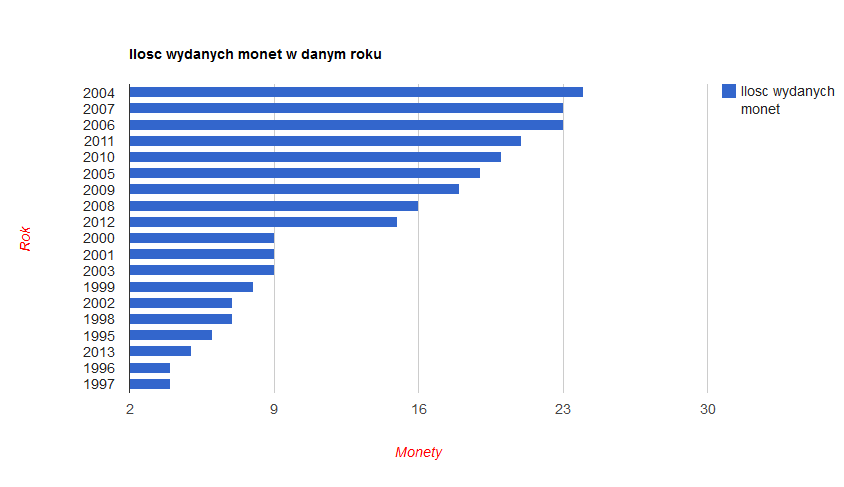
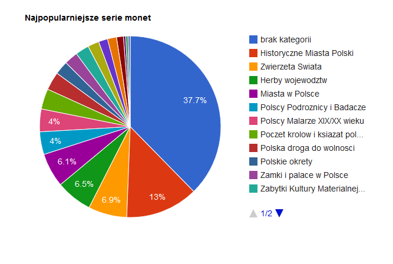
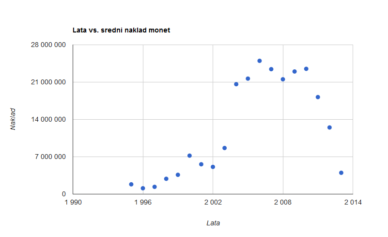

# Monety okolicznościowe 2 złote  
### *Mateusz Skorb*

## Co zostało zrobione?
1. Dane pobrałem w Wikipedii pod adresem: (http://pl.wikipedia.org/wiki/Monety_okoliczno%C5%9Bciowe_2_z%C5%82ote_%28III_RP%29)
* Wyczyściłem dane przy użyciu Google-Refine: usunęłem przypisy, niepotrzebną kolumnę a także stworzyłem nową kolumnę z latami, zmieniłem typ kolumny rok i nakład na liczbę.
* Dane wyexportowałem w Google-Refine do postaci czystego JSON.
* Format pliku tekstowego, który otrzymałem zmieniłem na JSON.
* Zaimportowałem json do bazy mongodb
* Utorzyłem podane niżej agregacje
* Wyczyściłem otrzymany JSON ponownie Google Refine 
* Utworzyłem za pomocą Google Chart Api wykresy

## Przykładowe JSONy które otrzymałem:
```json
{ "Moneta" : "Katyń, Miednoje, Charków 1940 ", "Rok" : 1995, "Seria" : null,  "Data emisji" : "3 kwietnia ", "Nakład" : 300000, "Projektant rewersu" : "Roussanka Nowakowska " },
{ "Moneta" : "Sum (Silurus glanis) ", "Rok" : 1995, "Seria" : "Zwierzęta Świata ",  "Data emisji" : "12 czerwca ", "Nakład" : 300000, "Projektant rewersu" : "Roussanka Nowakowska " },
{ "Moneta" : "75. rocznica bitwy warszawskiej ", "Rok" : 1995, "Seria" : null,  "Data emisji" : "11 sierpnia ", "Nakład" : 300000, "Projektant rewersu" : "Ewa Tyc-Karpińska " },
```
## Agregacje - przykład 1
Ilość wydanych monet w danym roku. 
```ruby
db.coins.aggregate(
    { 
        $group: {_id: "$Rok", quantity: {$sum: 1}} 
    },
        
    { 
        $sort: {quantity: -1}
    }
)
```


Otrzymałem następujący plik json:
```json
{
        "result" : [
                {
                        "_id" : "2004",
                        "quantity" : 24
                },
                {
                        "_id" : "2007",
                        "quantity" : 23
                },
                {
                        "_id" : "2006",
                        "quantity" : 23
                },
                {
                        "_id" : "2011",
                        "quantity" : 21
                },
                {
                        "_id" : "2010",
                        "quantity" : 20
                },
                {
                        "_id" : "2005",
                        "quantity" : 19
                },
                {
                        "_id" : "2009",
                        "quantity" : 18
                },
                {
                        "_id" : "2008",
                        "quantity" : 16
                },
                {
                        "_id" : "2012",
                        "quantity" : 15
                },
                {
                        "_id" : "2000",
                        "quantity" : 9
                },
                {
                        "_id" : "2001",
                        "quantity" : 9
                },
                {
                        "_id" : "2003",
                        "quantity" : 9
                },
                {
                        "_id" : "1999",
                        "quantity" : 8
                },
                {
                        "_id" : "2002",
                        "quantity" : 7
                },
                {
                        "_id" : "1998",
                        "quantity" : 7
                },
                {
                        "_id" : "1995",
                        "quantity" : 6
                },
                {
                        "_id" : "2013",
                        "quantity" : 5
                },
                {
                        "_id" : "1996",
                        "quantity" : 4
                },
                {
                        "_id" : "1997",
                        "quantity" : 4
                }
        ],
        "ok" : 1
 }
```

#### wykres:


[Wersja html](http://skorb.pl/projekty/nosql/chart1.html)


----
## Agregacje - przykład 2
Najpopularniejsze serie monet okolicznościowych 2zł. 

```ruby
db.coins.aggregate(
    { 
        $group: {_id: "$Serie", quantity: {$sum: 1}} 
    },
        
    { 
        $sort: {quantity: -1}
    }
)
```
Otrzymałem następujący plik json:
```json
{
        "result" : [
                {
                        "_id" : null,
                        "quantity" : 93
                },
                {
                        "_id" : "Historyczne Miasta Polski ",
                        "quantity" : 32
                },
                {
                        "_id" : "Zwierzęta Świata ",
                        "quantity" : 17
                },
                {
                        "_id" : "Herby województw ",
                        "quantity" : 16
                },
                {
                        "_id" : "Miasta w Polsce ",
                        "quantity" : 15
                },
                {
                        "_id" : "Polscy Podróżnicy i Badacze ",
                        "quantity" : 10
                },
                {
                        "_id" : "Polscy Malarze XIX/XX wieku ",
                        "quantity" : 10
                },
                {
                        "_id" : "Poczet królów i książąt polskich ",
                        "quantity" : 9
                },
                {
                        "_id" : "Polska droga do wolności ",
                        "quantity" : 8
                },
                {
                        "_id" : "Polskie okręty ",
                        "quantity" : 6
                },
                {
                        "_id" : "Zamki i pałace w Polsce ",
                        "quantity" : 6
                },
                {
                        "_id" : "Zabytki Kultury Materialnej w Polsce ",
                        "quantity" : 6
                },
                {
                        "_id" : "Historia Jazdy Polskiej ",
                        "quantity" : 5
                },
                {
                        "_id" : "Dzieje Złotego ",
                        "quantity" : 4
                },
                {
                        "_id" : "Polski Rok Obrzędowy ",
                        "quantity" : 4
                },
                {
                        "_id" : "Historia polskiej muzyki rozrywkowej ",
                        "quantity" : 3
                },
                {
                        "_id" : "Wielkie Bitwy ",
                        "quantity" : 1
                },
                {
                        "_id" : "Polskie Kluby Piłkarskie ",
                        "quantity" : 1
                },
                {
                        "_id" : "Zabytki Rzeczypospolitej ",
                        "quantity" : 1
                }
        ],
        "ok" : 1
}
```
#### wykres:


[Wersja html](http://skorb.pl/projekty/nosql/chart2.html)


## Agregacje - przykład 3
Monety w których latach są najbardziej pożądane przez kolekcjonetów, czyli w których latach średni nakład monet był najmnieszy.

```ruby
// Nakład w konkretnych latach
db.coins.aggregate( { $group :
                         { _id : { rok : "$Rok"},
                           Nakład : { $sum : "$Nakład" } } })
                           
//Monety z których lat są najbardziej porządane przez kolekcjonerow ( maja najmnieszy naklad)
db.coins.aggregate( { $group :
                         { _id : { rok : "$Rok"},
                           Nakład : { $sum : "$Nakład" } } },
                       { $group :
                       { _id : "$_id.rok",
                         avgNakład : { $avg : "$Nakład" } } },
                         
                         
                         { 
        $sort: {avgNakład: 1}
    } )
```
Otrzymałem następujący plik json:

```json
{
        "result" : [
                {
                        "rok" : 1996,
                        "avgNakład" : 1100000
                },
                {
                        "rok" : 1997,
                        "avgNakład" : 1365000
                },
                {
                        "rok" : 1995,
                        "avgNakład" : 1837300
                },
                {
                        "rok" : 1998,
                        "avgNakład" : 2880000
                },
                {
                        "rok" : 1999,
                        "avgNakład" : 3620000
                },
                {
                        "rok" : 2013,
                        "avgNakład" : 4000000
                },
                {
                        "rok" : 2002,
                        "avgNakład" : 5110000
                },
                {
                        "rok" : 2001,
                        "avgNakład" : 5600000
                },
                {
                        "rok" : 2000,
                        "avgNakład" : 7220000
                },
                {
                        "rok" : 2003,
                        "avgNakład" : 8650000
                },
                {
                        "rok" : 2012,
                        "avgNakład" : 12500000
                },
                {
                        "rok" : 2011,
                        "avgNakład" : 18200000
                },
                {
                        "rok" : 2004,
                        "avgNakład" : 20620000
                },
                {
                        "rok" : 2008,
                        "avgNakład" : 21540000
                },
                {
                        "rok" : 2005,
                        "avgNakład" : 21670000
                },
                {
                        "rok" : 2009,
                        "avgNakład" : 23000000
                },
                {
                        "rok" : 2007,
                        "avgNakład" : 23440000
                },
                {
                        "rok" : 2010,
                        "avgNakład" : 23500000
                },
                {
                        "rok" : 2006,
                        "avgNakład" : 25000000
                }
        ],
        "ok" : 1
}
```

#### wykres:



[Wersja html](http://skorb.pl/projekty/nosql/chart3.html)

## Linki

* [Czyste dane JSON] (/data/json/mskorb.json)


