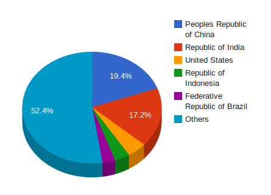

## GeoNames - country, state, region, city, village, road, railroad
///              Przemysław Jakuła              \\\

## Wstępny opis:

Dane zostały zaciągnięte ze strony [http://download.geonames.org/export/dump/]. 

Dane dotyczą różnych miejsc na świecie, uwzględniając kraje, stolice, miasta/wsie, populacje miast/wsi, ulice, autostrady, miasta już nieistniejące, rzeki itd. Wszystko w skali świata.

Z danych postanowiłem wyciągnąć tytułowe "country, state, region, city, village, road, railroad" (razem: 3 510 451 rekordów po przetworzeniu)

## Wykonane kroki:

1. Ściągnięcie danych w postaci pliku csv
* Wczytanie danych do google-refine
* Usunięcie danych z "feature_class" różnym od A,P,R (nie związanymi z danymi tytułowymi)
* Refaktoryzacja id pozostałych wierszy (zaczynając od 1)
* Usunięcie kolumn: name, alternatenames
* Eksport do plików JSON

## Przykładowe dane:
```json
{"id" : 1732787,"name" : "Gdansk","latitude" : 54.35205,"longitude" : 18.64637,"feature_class" : "P","feature_code" : "PPLA","country_code" : "PL","cc2" : null,"admin1_code" : 82,"admin2_code" : 2261,"admin3_code" : 226101,"admin4_code" : null,"population" : 461865,"elevation" : null,"dem" : 7,"timezone" : "Europe/Warsaw","modification_date" : "2011-10-14"}
```
```json
{"id" : 447626,"name" : "Warsaw","latitude" : 52.22977,"longitude" : 21.01178,"feature_class" : "P","feature_code" : "PPLC","country_code" : "PL","cc2" : null,"admin1_code" : 78,"admin2_code" : 1465,"admin3_code" : null,"admin4_code" : null,"population" : 1702139,"elevation" : null,"dem" : 113,"timezone" : "Europe/Warsaw","modification_date" : "2012-11-15"}
```

[Pełne dane po przetworzeniu na google-drive ze względu na ich wielkość (ok. 1GB)](https://drive.google.com/folderview?id=0B4yVP4J-xy3wLTRtNXA1U244Y0E&usp=sharing)

## Agregacje:

### Kraje z najliczniejszą populacją (top 5)

```
db.region.aggregate(
	{
		"$match" : {
			"feature_class" : "A",
			"feature_code" : "PCLI"
        	}
	},
	{
		$group: {
			_id: {"name" : "$name", "feature_class": "$feature_class", "feature_code" : "$feature_code"}, 
			totalPop: {$sum: "$population"}} 
	},
	{ $sort: {totalPop: -1} },
	{ $limit: 5}
)
```
```json
{
	"result" : [
		{
			"_id" : {
				"name" : "People's Republic of China",
				"feature_class" : "A",
				"feature_code" : "PCLI"
			},
			"totalPop" : 1330044000
		},
		{
			"_id" : {
				"name" : "Republic of India",
				"feature_class" : "A",
				"feature_code" : "PCLI"
			},
			"totalPop" : 1173108018
		},
		{
			"_id" : {
				"name" : "United States",
				"feature_class" : "A",
				"feature_code" : "PCLI"
			},
			"totalPop" : 310232863
		},
		{
			"_id" : {
				"name" : "Republic of Indonesia",
				"feature_class" : "A",
				"feature_code" : "PCLI"
			},
			"totalPop" : 242968342
		},
		{
			"_id" : {
				"name" : "Federative Republic of Brazil",
				"feature_class" : "A",
				"feature_code" : "PCLI"
			},
			"totalPop" : 201103330
		}
	],
	"ok" : 1
}
```


### Łączna populacja we wszystkich stolicach świata
```
db.region.aggregate(
{
        "$match" : {
		"feature_class" : "P",
		"feature_code" : "PPLC"
        }
    },
    {
        "$group" : {
            "_id" : null,
            "cities" : {
                "$push" : {
		    "name" : "$name",
                    "feature_class" : "$feature_class",
		    "feature_code" : "$feature_code",
		    "population" : "$population"
                }
            },
            "population" : {
                $sum:"$population"
            }
        }
    },
    {
        "$project" : {
            //"cities" : 1,
            "total" : "$population"
        }
    }
)
```
```json
{ "result" : [ { "_id" : null, "total" : 326512489 } ], "ok" : 1 }
```

## Wrażenia z pracy:
1. Smutek! Google refine bardzo mnie zawiodło. Ładowanie pliku (ponad 8mln rekordów) trwało prawie cały dzień. 
2. Wcześniej sprawdziłem na mniejszej ilości danych i okazało się, że nie bierze pod uwagę separatora typu "tabulacja".
3. Przy okazji wyszło, że nie radzi sobie kompletnie z niedomkniętymi znakami typu ",' - występujące w innych językach.
4. Operacje wykonywane na danych trwały tak długo, że zostałem doprowadzony do skrajnej wytrzymałości nerwowej i zakończyłem pracę na ów dzień.
5. Zmieniłem podejście.
6. Zaciągnąłem plik csv do bazy db2.
7. Wstępnie przeczyściłem dane w db2 przy pomocy zapytań.
8. Wyciągnąłem plik csv z db2 (ok. 3.5 mln wierszy)
9. Komendą "split -l 500 000" podzieliłem plik csv na mniejsze i ładowałem je kolejno do google-refine
10. Google refine robił mnie w konia - jeden plik ładował w 20-30 sekund, inny szacował do godziny....
11. Zwiększyłem przydział pamięci dla Google refine. Wreszcie zaczął ładować pliki normalnie (ok. 2-3 pod rząd, potem znowu zaczynał mnie okłamywać, pomagał reset)
12. Przy pomocy Google refine wykonałem na każdym pliku to samo - przetworzyłem numeracje id wierszy, usunąłem zbędne kolumny, poprawiłem niektóre znaki.
13. Wyeksportowałem każdy plik w postaci json.
14. WNIOSEK: Od punktu 8 do 13 dzieliło mnie kilka dodatkowych zapytań na bazie wykonywanych w zaledwie kilka-kilkanaście sekund. Niestety google refine nie zrobił na mnie zbyt wielkiego wrażenia, wręcz zawiódł mnie na całej linii. Może gdybym wziął dane do 200 000 - 300 000 wierszy byłoby inaczej.

## Pola tabeli:

```
The main 'geoname' table has the following fields :
---------------------------------------------------
geonameid         : integer id of record in geonames database\n
name              : name of geographical point (utf8) varchar(200)
asciiname         : name of geographical point in plain ascii characters, varchar(200)
alternatenames    : alternatenames, comma separated varchar(5000)
latitude          : latitude in decimal degrees (wgs84)
longitude         : longitude in decimal degrees (wgs84)
feature class     : see http://www.geonames.org/export/codes.html, char(1)
feature code      : see http://www.geonames.org/export/codes.html, varchar(10)
country code      : ISO-3166 2-letter country code, 2 characters
cc2               : alternate country codes, comma separated, ISO-3166 2-letter country code, 60 characters
admin1 code       : fipscode (subject to change to iso code), see exceptions below, see file admin1Codes.txt for display names of this code; varchar(20)
admin2 code       : code for the second administrative division, a county in the US, see file admin2Codes.txt; varchar(80)
admin3 code       : code for third level administrative division, varchar(20)
admin4 code       : code for fourth level administrative division, varchar(20)
population        : bigint (8 byte int)
elevation         : in meters, integer
dem               : digital elevation model, srtm3 or gtopo30, average elevation of 90mx90m or 900mx900m area in meters, integer. srtm processed by cgiar/ciat
timezone          : the timezone id (see file timeZone.txt) varchar(40)
modification date : date of last modification in yyyy-MM-dd format
```
* Kopia ze strony [http://download.geonames.org/export/dump/]
* [Pełne dane po przetworzeniu na google-drive ze względu na ich wielkość (ok. 1GB)](https://drive.google.com/folderview?id=0B4yVP4J-xy3wLTRtNXA1U244Y0E&usp=sharing)

