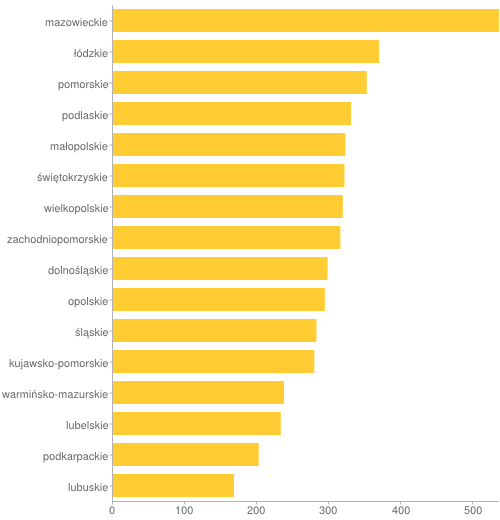
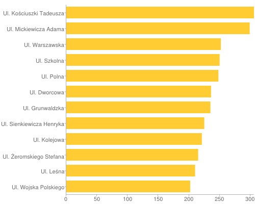
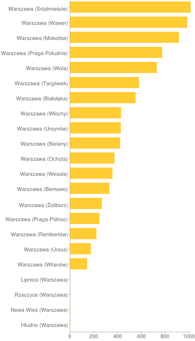

# Dane historyczne notowań WIG20
------------------------------
##Źródło danych

Oryginalne dane pobrałem w formacie csv z serwisu [stooq.pl](http://stooq.pl/q/d/?s=wig20&c=0)

## Oczyszczanie danych
1. Pobranie danych w formacie csv z podanego wyżej serwisu.
* Import danych do Google-Refine (kosmetyczne zmiany).
* Export danych do postaci JSON.

## Przykładowe rekordy:
```json
    {
      "Data" : "2013-03-07",
      "Otwarcie" : 2478.96,
      "Najwyzszy" : 2485,
      "Najnizszy" : 2471.46,
      "Zamkniecie" : 2474.7,
      "Wolumen" : 29561629
    }
    {
      "Data" : "2013-03-08",
      "Otwarcie" : 2485.48,
      "Najwyzszy" : 2505.66,
      "Najnizszy" : 2480.86,
      "Zamkniecie" : 2490.7,
      "Wolumen" : 26154320
    }
```
* Oczyszczone Dane:
[Klik](/data/json/pslaski_wig20.json)


#Agregacje

Do agregacji użyłem danych historycznych WIG20 oraz danych o kodach pocztowych w Polsce

* [Link do skryptu](/scripts/ruby/agg_pslaski.rb)

## Przykłady

##  5 najwyższych zamknięć WIG20 w roku 2005

```ruby
highest_exits = wig20.aggregate([{'$project' => {:_id => 0, :Data => 1, :Zamkniecie => 1}},
                                 {'$match' => {:Data => /2005-.*/}},
                                 {'$sort' => {:Zamkniecie => -1}},
                                 {'$limit' => 5}
                                ])
```

Rezultat:

```bson
{"Data"=>"2005-12-27", "Zamkniecie"=>2699.07}
{"Data"=>"2005-12-29", "Zamkniecie"=>2693.75}
{"Data"=>"2005-12-28", "Zamkniecie"=>2683.29}
{"Data"=>"2005-12-23", "Zamkniecie"=>2662.32}
{"Data"=>"2005-12-30", "Zamkniecie"=>2654.95}
```

##  Średnia liczba kodów pocztowych dla powiatu w danym województwie

```ruby
county_avg = zipcodes.aggregate([{'$group' => 
					{:_id => {:powiat => '$powiat', :wojewodztwo => '$wojewodztwo'}, nt => {'$sum' => 1}}},
                                 {'$group' => 
                                 	{:_id => '$_id.wojewodztwo', :avg => {'$avg' => '$' + count}}},
                                 {'$sort' => {:avg => -1}},
                                 {'$project' => {:_id => 0, :wojewodztwo => '$_id', :avg => 1}}])
```

Rezultat:

```bson
{"avg"=>535.7872340425532, "wojewodztwo"=>"mazowieckie"}
{"avg"=>369.18518518518516, "wojewodztwo"=>"łódzkie"}
{"avg"=>352.25, "wojewodztwo"=>"pomorskie"}
{"avg"=>330.5, "wojewodztwo"=>"podlaskie"}
{"avg"=>322.52, "wojewodztwo"=>"małopolskie"}
{"avg"=>321.26666666666665, "wojewodztwo"=>"świętokrzyskie"}
{"avg"=>318.97435897435895, "wojewodztwo"=>"wielkopolskie"}
{"avg"=>315.625, "wojewodztwo"=>"zachodniopomorskie"}
{"avg"=>297.78125, "wojewodztwo"=>"dolnośląskie"}
{"avg"=>294.0769230769231, "wojewodztwo"=>"opolskie"}
{"avg"=>282.45454545454544, "wojewodztwo"=>"śląskie"}
{"avg"=>279.4074074074074, "wojewodztwo"=>"kujawsko-pomorskie"}
{"avg"=>237.3913043478261, "wojewodztwo"=>"warmińsko-mazurskie"}
{"avg"=>232.92857142857142, "wojewodztwo"=>"lubelskie"}
{"avg"=>202.24137931034483, "wojewodztwo"=>"podkarpackie"}
{"avg"=>167.9375, "wojewodztwo"=>"lubuskie"}
```


## Ulice z największą liczbą kodów w Polsce (>= 200)

```ruby
max_streets = zipcodes.aggregate([{'$match' => {:ulica => /.*/}},
                                  {'$group' => {:_id => {:ulica => '$ulica'}, count => {'$sum' => 1}}},
                                  {'$match' => {:count => {'$gte' => 200}}},
                                  {'$sort' => {:count => -1}},
                                  {'$project' => {:_id => 0, :ulica => '$_id.ulica', :count => 1}}])
```

Rezultat:

```bson
{"count"=>306, "ulica"=>"Ul. Kościuszki Tadeusza"}
{"count"=>299, "ulica"=>"Ul. Mickiewicza Adama"}
{"count"=>252, "ulica"=>"Ul. Warszawska"}
{"count"=>250, "ulica"=>"Ul. Szkolna"}
{"count"=>248, "ulica"=>"Ul. Polna"}
{"count"=>236, "ulica"=>"Ul. Dworcowa"}
{"count"=>235, "ulica"=>"Ul. Grunwaldzka"}
{"count"=>225, "ulica"=>"Ul. Sienkiewicza Henryka"}
{"count"=>221, "ulica"=>"Ul. Kolejowa"}
{"count"=>215, "ulica"=>"Ul. Żeromskiego Stefana"}
{"count"=>210, "ulica"=>"Ul. Leśna"}
{"count"=>202, "ulica"=>"Ul. Wojska Polskiego"}
```


## Znalezienie miejscowości z kodem w postaci xx-xxx np. 11-111, 22-222 itp.

```ruby
zip_with_same_digits = zipcodes.aggregate([{'$match' => {:kod => /(\d)\1-\1\1\1/}},
                                           {'$sort' => {:kod => -1}},
                                           {'$project' => {:_id => 0, :kod => 1, :miejsce => 1}}])
```

Rezultat:

```bson
{"kod"=>"33-333", "miejsce"=>"Cieniawa"}
{"kod"=>"33-333", "miejsce"=>"Ptaszkowa"}
```

## Liczba kodów dla poszczególnych dzielnic aglomeracji warszawskiej

```ruby
warsaw_zips = zipcodes.aggregate([{'$match' => {:miejsce => /Warszawa/}},
                                  {'$group' => 
                                  	{:_id => {:miejsce => '$miejsce'}, count => {'$sum' => 1}}},
                                  {'$project' => {:_id => 0, :miejsce => '$_id.miejsce', count => 1}},
                                  {'$sort' => {count => -1}}])
```

Rezultat:

```bson
{"count"=>1013, "miejsce"=>"Warszawa (Śródmieście)"}
{"count"=>984, "miejsce"=>"Warszawa (Wawer)"}
{"count"=>915, "miejsce"=>"Warszawa (Mokotów)"}
{"count"=>774, "miejsce"=>"Warszawa (Praga-Południe)"}
{"count"=>729, "miejsce"=>"Warszawa (Wola)"}
{"count"=>579, "miejsce"=>"Warszawa (Targówek)"}
{"count"=>551, "miejsce"=>"Warszawa (Białołęka)"}
{"count"=>428, "miejsce"=>"Warszawa (Włochy)"}
{"count"=>426, "miejsce"=>"Warszawa (Ursynów)"}
{"count"=>420, "miejsce"=>"Warszawa (Bielany)"}
{"count"=>373, "miejsce"=>"Warszawa (Ochota)"}
{"count"=>356, "miejsce"=>"Warszawa (Wesoła)"}
{"count"=>330, "miejsce"=>"Warszawa (Bemowo)"}
{"count"=>267, "miejsce"=>"Warszawa (Żoliborz)"}
{"count"=>247, "miejsce"=>"Warszawa (Praga-Północ)"}
{"count"=>221, "miejsce"=>"Warszawa (Rembertów)"}
{"count"=>174, "miejsce"=>"Warszawa (Ursus)"}
{"count"=>143, "miejsce"=>"Warszawa (Wilanów)"}
{"count"=>1, "miejsce"=>"Lipnica (Warszawa)"}
{"count"=>1, "miejsce"=>"Rzeczyce (Warszawa)"}
{"count"=>1, "miejsce"=>"Nowa Wieś (Warszawa)"}
{"count"=>1, "miejsce"=>"Hłudno (Warszawa)"}
```

