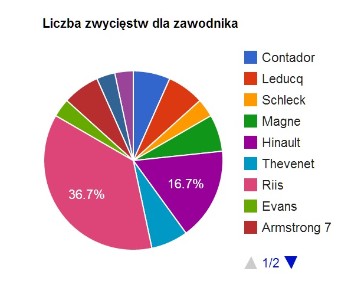
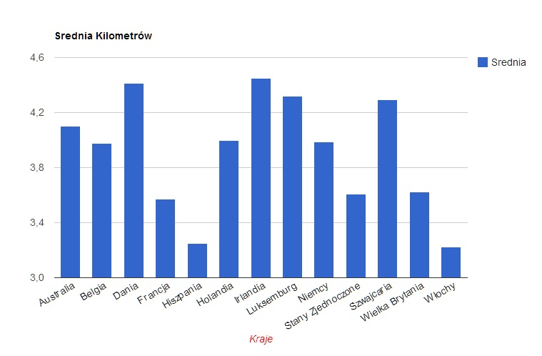
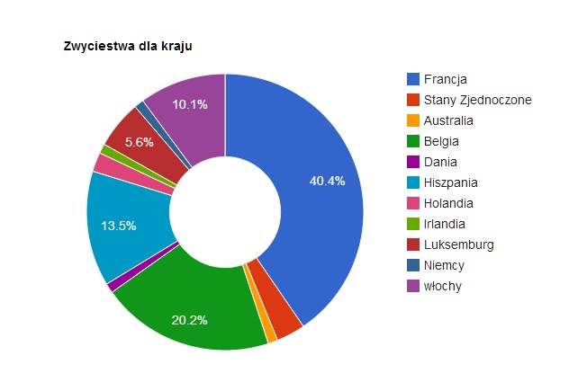

# Zwyciezcy Tour de Frane 
### *Paweł Zawodny*

## Co zostało zrobione?
1. Dane pobrałem w Wikipedii pod adresem: http://pl.wikipedia.org/wiki/Tour_de_France
* Wyczyściłem dane przy użyciu Google-Refine
* Dane wyexportowałem w Google-Refine do postaci czystego JSON.
* Format pliku tekstowego, który otrzymałem zmieniłem na JSON.
* Zaimportowałem json do bazy mongodb
* Utorzyłem podane niżej agregacje
* Wyczyściłem otrzymany JSON ponownie Google Refine 
* Utworzyłem za pomocą Google Chart Api wykresy

## Przykładowe JSONy które otrzymałem:
```json
{ "lp" : 100, "rok" : 2013, "km" : 3.36, "zwycięzca" : "Christopher Froome ", "kraj" : " Wielka Brytania ", "2. miejsce" : "Nairo Quintana ","kraj2" : " Kolumbia ","3. miejsce" : "Joaquim Rodríguez ","kraj3" : " Hiszpania ", "raport" : "TdF 2013"}, 
{ "lp" : 99, "rok" : 2012, "km" : 3.497, "zwycięzca" : "Bradley Wiggins ", "kraj" : " Wielka Brytania ", "2. miejsce" : "Christopher Froome ","kraj2" : " Wielka Brytania ","3. miejsce" : "Vincenzo Nibali ","kraj3" : " Włochy ", "raport" : "TdF 2012"}, 
{ "lp" : 98, "rok" : 2011, "km" : 3.43, "zwycięzca" : "Cadel Evans ", "kraj" : " Australia ", "2. miejsce" : "Andy Schleck ","kraj2" : " Luksemburg ","3. miejsce" : "Fränk Schleck ","kraj3" : " Luksemburg ", "raport" : "TdF 2011"}, 
```


## Agregacje - przykład 1
Liczba zwycięstw dla zawodnika. 
```ruby
db.tdf.aggregate(
    { 
        $group: {_id: "$zwycięzca", quantity: {$sum: 1}} 
    },
        
    { 
        $sort: {quantity: -1}
    }
)
```


Otrzymałem następujący plik json:
```json
{
        "result" : [
                {
                        "_id" : "Alberto Contador",
                        "quantity" : 2
                },
                {
                        "_id" : "Andre Leducq",
                        "quantity" : 2
                },
                {
                        "_id" : "Andy Schleck",
                        "quantity" : 1
                },
                {
                        "_id" : "Antonin Magne",
                        "quantity" : 2
                },
                {
                        "_id" : "Bernard Hinault",
                        "quantity" : 5
                },
                {
                        "_id" : "Bernard Thevenet",
                        "quantity" : 2
                },
                {
                        "_id" : "Bjarne Riis",
                        "quantity" : 11
                },
                {
                        "_id" : "Cadel Evans",
                        "quantity" : 1
                },
                {
                        "_id" : "Lance Armstrong",
                        "quantity" : 7
                },
                {
                        "_id" : "Lucien Aimar",
                        "quantity" : 1
                },
                {
                        "_id" : "Luis Ocana",
                        "quantity" : 1
                },
                
        ],
        "ok" : 1
 }
```

#### wykres:



----
## Agregacje - przykład 2
Średnia kilometrów dla danego kraju:

```ruby
#srednia ilość kilometrów na kraj
db.tdf.aggregate( { $group :
                         { _id : { kraj : "$kraj"},
                           km : { $sum : "$km" } } },
                       { $group :
                       { _id : "$_id.kraj",
                         avgKm : { $avg : "$km" } } },


                         { 
        $sort: {avgKm: 1}
    } )
```	

Otrzymałem następujący plik json:

```json
{
        "result" : [

                {
                        "_id" : "Francja ",
                        "quantity" : 3.57
                },
                {
                        "_id" : "Stany Zjednoczone ",
                        "quantity" : 2.25
                },
                {
                        "_id" : "Australia ",
                        "quantity" : 4.1
                },
                {
                        "_id" : "Belgia ",
                        "quantity" : 3.978
                },
                {
                        "_id" : "Dania ",
                        "quantity" : 4.117
                },
                {
                        "_id" : "Hiszpania ",
                        "quantity" : 4
                },
                {
                        "_id" : "Holandia ",
                        "quantity" : 4.504
                },
                {
                        "_id" : "Irlandia ",
                        "quantity" : 4.322
                },
				{
                        "_id" : "Luksemburg ",
                        "quantity" : 3.987
                },
                {
                        "_id" : "Niemcy ",
                        "quantity" : 3.607
                },
                {
                        "_id" : "Wochy ",
                        "quantity" : 4.293
                },
         
        "ok" : 1
}
```

#### wykres:



----
## Agregacje - przykład 3
Liczba zwycięstw dla danego kraju.

```ruby
# Liczba zwycięstw dla danego kraju.
db.tdf.aggregate(
    { 
        $group: {_id: "$kraj", quantity: {$sum: 1}} 
    },

    { 
        $sort: {quantity: -1}
    }
)
```
Otrzymałem następujący plik json:

```json
{
        "result" : [

                {
                        "_id" : "Francja ",
                        "quantity" : 36
                },
                {
                        "_id" : "Stany Zjednoczone ",
                        "quantity" : 3
                },
                {
                        "_id" : "Australia ",
                        "quantity" : 1
                },
                {
                        "_id" : "Belgia ",
                        "quantity" : 18
                },
                {
                        "_id" : "Dania ",
                        "quantity" : 1
                },
                {
                        "_id" : "Hiszpania ",
                        "quantity" : 12
                },
                {
                        "_id" : "Holandia ",
                        "quantity" : 2
                },
                {
                        "_id" : "Irlandia ",
                        "quantity" : 1
                },
				{
                        "_id" : "Luksemburg ",
                        "quantity" : 5
                },
                {
                        "_id" : "Niemcy ",
                        "quantity" : 1
                },
                {
                        "_id" : "Włochy ",
                        "quantity" : 9
                },
         
        "ok" : 1
}
```

#### Wykres:



## Linki:
![Czyste dane JSON] (../data/json/zwyciezcyTDF.json)

