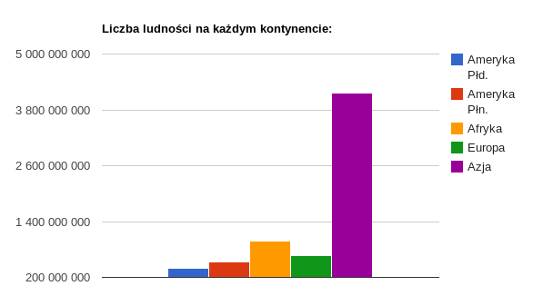
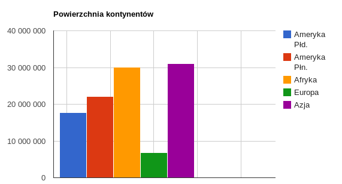
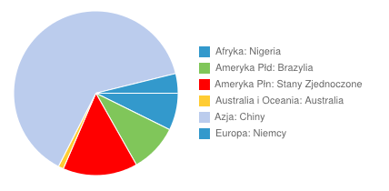

Państwa świata
Romuald Łuczyk, 186499
==============

Dane pobrane ze strony [Państwa świata - wiki](http://pl.wikipedia.org/wiki/Pa%C5%84stwa_%C5%9Bwiata)
Narzędzie do oczyszczania danych: Google Refine

#Kroki:
* import danych do programu
* usunięcie niepotrzebnych kolumn
* Poprawienie literówek
* Usunięcie niepotrzebnych informacji przy pomocy GREL
* Usunięcie znaczników HTML przy pom. GREL
* Konwersja trzech kolumn jako numeryczne
* Eksport pliku w formacie JSON

## Przykładowe dane
```json
{"panstwo" : "Polska","kontynent" : "Europa","stolica" : "Warszawa","powierzchnia" : 322575,"liczba_ludnosci" : 3.8200037E7,"gestosc_zaludnienia" : 120}
{"panstwo" : "Portugalia","kontynent" : "Europa","stolica" : "Lizbona","powierzchnia" : 92391,"liczba_ludnosci" : 1.0677E7,"gestosc_zaludnienia" : 116} 
```

# Import do bazy danych:
```
mongoimport --db test --collection panstwa --file panstwa.json
```

#Przykladowe agregacje:
* Liczba ludzi na każdym kontynencie:

```js
collection.aggregate([
	{ $group :
              { _id : "$kontynent",
                ludnosc : { $sum : "$liczba_ludnosci" } } }
	], function(error, result) {
		if (error) throw error;
		console.dir(result);
	});
```

Wynik:
```
[ { _id: 'Australia i Oceania', ludnosc: 34954085 },
  { _id: 'Ameryka Północna', ludnosc: 531826101 },
  { _id: 'Europa', ludnosc: 668568120 },
  { _id: 'Ameryka Południowa', ludnosc: 398201711 },
  { _id: 'Afryka', ludnosc: 982613161 },
  { _id: 'Azja', ludnosc: 4153098901 } ]
```



* Powierzchnia kazdego z kontynentow

```js
collection.aggregate([
	{ $group :
              { _id : "$kontynent",
                powierzchnia : { $sum : "$powierzchnia" }, }},
	], function(error, result) {
		if (error) throw error;
		console.log("\nPowierzchnia kazdego z kontynentow");
		console.dir(result);
	});


```
Wynik:
```
[ { _id: 'Australia i Oceania', powierzchnia: 8483222 },
  { _id: 'Ameryka Północna', powierzchnia: 22067066 },
  { _id: 'Europa', powierzchnia: 6807425 },
  { _id: 'Ameryka Południowa', powierzchnia: 17720645 },
  { _id: 'Afryka', powierzchnia: 30060875 },
  { _id: 'Azja', powierzchnia: 31099591 } ]
```



* Najludniejsze panstwo na kazdym z kontynentow:

```js
collection.aggregate([
	{ $group:
              { _id: { kontynent: "$kontynent", panstwo: "$panstwo" },
                liczba_ludnosci: { $sum: "$liczba_ludnosci" } } },
                  { $sort: { liczba_ludnosci: 1 } },
                   { $group:
                    { _id : "$_id.kontynent",
                      najwieksze_panstwo:  { $last: "$_id.panstwo" },
                      ludnosc:   { $last: "$liczba_ludnosci" } } }
	], function(error, result) {
		if (error) throw error;
		console.log("\nNajludniejsze panstwo na kazdym z kontynentow:");
		console.dir(result);
	});

```

Wynik:
```
[ { _id: 'Ameryka Południowa',
    najwieksze_panstwo: 'Brazylia',
    ludnosc: 201103330 },
  { _id: 'Azja', najwieksze_panstwo: 'Chiny', ludnosc: 1347374752 },
  { _id: 'Afryka',
    najwieksze_panstwo: 'Nigeria',
    ludnosc: 154729000 },
  { _id: 'Ameryka Północna',
    najwieksze_panstwo: 'Stany Zjednoczone',
    ludnosc: 311280492 },
  { _id: 'Australia i Oceania',
    najwieksze_panstwo: 'Australia',
    ludnosc: 22343203 },
  { _id: 'Europa',
    najwieksze_panstwo: 'Niemcy',
    ludnosc: 81772000 } ]
```



Żródło oczyszczonych danych: (/data/json/panstwa_rluczyk.json)
Źródło skryptu: (/scripts/javascript/rluczyk_panstwa.json)
