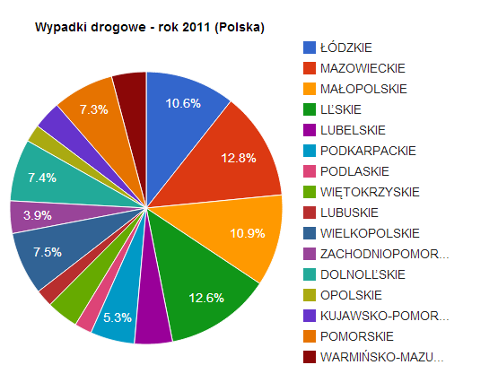
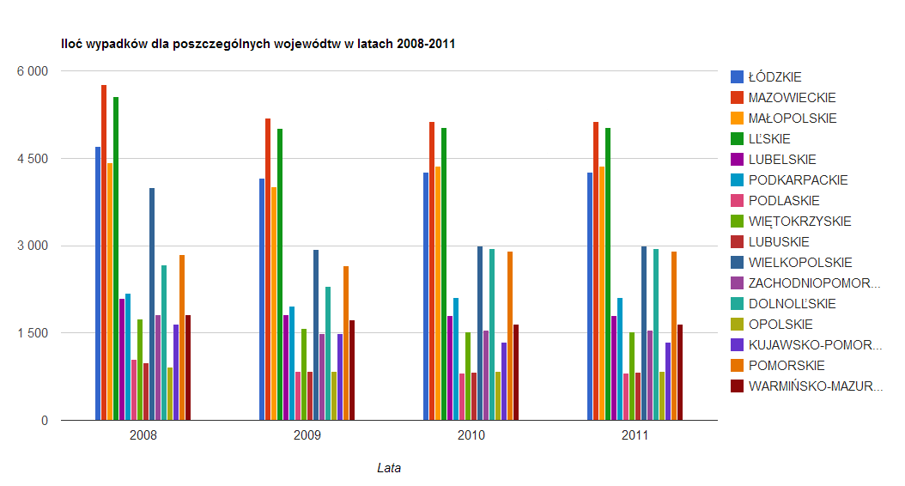

# Wypadki drogowe na polskich drogach w latach 2000 - 2011.

## Źródło danych

http://www.stat.gov.pl/bdl/app/strona.html?p_name=indeks (Główny Urząd Statystyczny)

## Co zostało zrobione?

* Pobranie danych statystycznych (csv)
* Zaimportowanie danych do Google Refine
* Wyczyszczenie danych oraz edycja danych za pomocą Google Refine
* Eksport danych do formatu JSON

## Przykład danych w formacie JSON:

```js
{
      "Kod" : 0,
      "Jednostka terytorialna" : "POLSKA",
      "wypadki ogółem 2000" : 57331,
      "wypadki ogółem 2001" : 53799,
      "wypadki ogółem 2002" : 53559,
      "wypadki ogółem 2003" : 51078,
      "wypadki ogółem 2004" : 51069,
      "wypadki ogółem 2005" : 48100,
      "wypadki ogółem 2006" : 46876,
      "wypadki ogółem 2007" : 49536,
      "wypadki ogółem 2008" : 49054,
      "wypadki ogółem 2009" : 44196,
      "wypadki ogółem 2010" : 38832,
      "wypadki ogółem 2011" : 40065
    },
    {
      "Kod" : 1100000000,
      "Jednostka terytorialna" : " ŁÓDZKIE",
      "wypadki ogółem 2000" : 4712,
      "wypadki ogółem 2001" : 4814,
      "wypadki ogółem 2002" : 4631,
      "wypadki ogółem 2003" : 4628,
      "wypadki ogółem 2004" : 4826,
      "wypadki ogółem 2005" : 4753,
      "wypadki ogółem 2006" : 4554,
      "wypadki ogółem 2007" : 4847,
      "wypadki ogółem 2008" : 4773,
      "wypadki ogółem 2009" : 4709,
      "wypadki ogółem 2010" : 4157,
      "wypadki ogółem 2011" : 4266
    },
    {
      "Kod" : 1140000000,
      "Jednostka terytorialna" : " MAZOWIECKIE",
      "wypadki ogółem 2000" : 7627,
      "wypadki ogółem 2001" : 7224,
      "wypadki ogółem 2002" : 7224,
      "wypadki ogółem 2003" : 6805,
      "wypadki ogółem 2004" : 6375,
      "wypadki ogółem 2005" : 6452,
      "wypadki ogółem 2006" : 6617,
      "wypadki ogółem 2007" : 6881,
      "wypadki ogółem 2008" : 6910,
      "wypadki ogółem 2009" : 5763,
      "wypadki ogółem 2010" : 5190,
      "wypadki ogółem 2011" : 5130
    }
```

## Diagramy wykonane przy użyciu Google Chart Tools





## Przykład agregacji:

```js

/* Nawięcej obiektów pod jednym kodem pocztowym */

coll = db.kody_pocztowe

coll.aggregate(
  { $group: {_id: "$kod", postal_codes: { $sum: 1 } } },
  { $sort: { postal_codes: -1 } },
  { $limit: 5 }
)

/* Najwięcej ulic o danej nazwie w jednym województwie */

coll.aggregate(
  { $group: {_id: { ulica: "$ulica", wojewodztwo: "$wojewodztwo" }, ulice: { $sum: 1 } } },
  /* { $match: { ulica: { $ne: null } } }, */
  { $sort: { ulice: -1 } },
  { $limit: 20 }
)

/* Największy wzrost ceny */

coll = db.ceny

coll.aggregate(
  { $group: {_id: "$towar", max_cena: { $max: "$cena"  }, min_cena: { $min: "$cena" } } },
  { $match: { max_cena: { $gt: 0 }, min_cena: { $gt: 0 } } },
  { $project: { max_cena: 1, min_cena: 1, diff: { $divide: ["$max_cena", "$min_cena"] } } },
  { $sort: { diff: -1 } },
  { $limit: 5 }
)

/* Miesiac, w ktorym najwiecej osob ma imieniny */

coll = db.imieniny

coll.aggregate(
  { $unwind: "$names" },
  { $group: {_id: { month: "$date.month" }, namesPerMonth: { $sum: 1 } } },
  { $sort: { namesPerMonth: -1 } },
  { $limit: 5 }
)
```

## Pliki:

[plik csv przed użyciem Google Refine] (/data/csv/wypadki_drogowe.csv)
[Po użyciu Google Refine w formacie JSON](/data/json/wypadki_drogowe.json)
